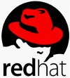

.sigblock[
Josh Berkus, Jason Brooks, Ryan Jarvinen

Red Hat

Usenix LISA 2017
]

.leftlogo[]

---

## The Upstream Team

* Josh Berkus: Fedora Atomic
* Jason Brooks: CentOS Atomic
* Ryan Jarvinen: OpenShift Origin
* Ryan Jarvinen: OpenShift Origin

---

## A BOF, Not a Talk:

1. Micro-preso on moving to Atomic
2. Micro-preso on moving to OpenShift
3. Discussion with **you**

---

---

## Atomic Host is ...

* a minimal OS
* a container host OS
* an immutable OS

---

---

## Links

Github:

* /kubernetes-incubator/cri-o
* /cri-o/cri-o-ansible

Project Atomic:

* www.projectatomic.io/blog
* IRC Frenode #atomic

---

## Get in touch

.left-column[
web:

IRC:

my events:
]

.right-column[
www.projectatomic.io

\#atomic

www.ContainerDaysPDX.org 
August 3, Portland

Cloud Native Portland 
meetup.com/Cloud-Native-PDX/

]

.leftlogo[]

.rightlogo[]
