#### Bots Not Cattle

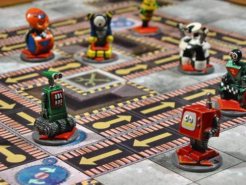

.sigblock[
Josh Berkus

Red Hat OSAS

OSBridge 2016
]

.leftlogo[]

---

#### DevOps

---

---

## third wave of automation

1. packages
2. configuration management
3. ???

---

## third wave of automation

1. packages
2. configuration management
3. container orchestration?

---

## third wave of automation

1. packages
2. a. configuration management 
 &nbsp;b. container orchestration

---

## third wave of automation

1. packages
2. a. configuration management 
 &nbsp;b. container orchestration
3. ???

---

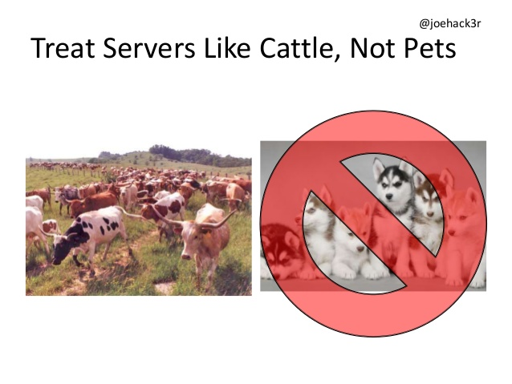

---

## pets

* require special pampering
* have names
* get taken to the vet when sick

---

## cattle

* get herded in large groups
* have numbers
* get butchered if sick

---

## the DevOps metaphor

* 10 servers: pets
* 10,000 servers: cattle

---

## the problem with cattle

* *dumb*
* herd them in (sort of) one direction
* centrally managed

---

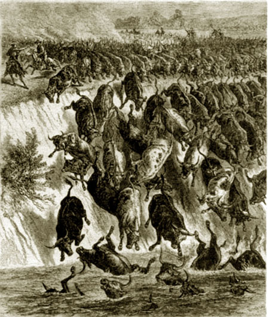

---

## central management limits

* infrastructure scale
* people scale
* dev/ops split
* application sophistication

---

## Roborally

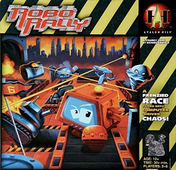

---

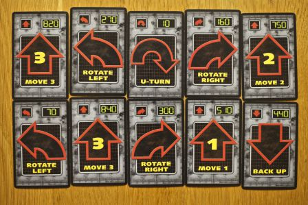

---

---

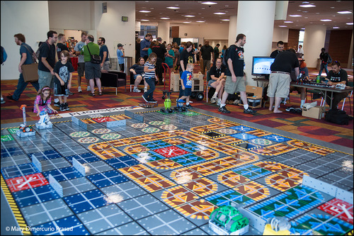

---

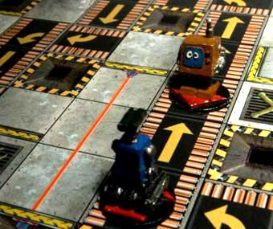

---

---

---

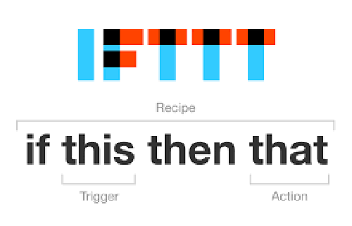

---

## intelligent bots

* capable of reacting to deployment, configuration, and availablity events
* programmed to "do the right thing" in each case

---

## state machine

---

## state machine

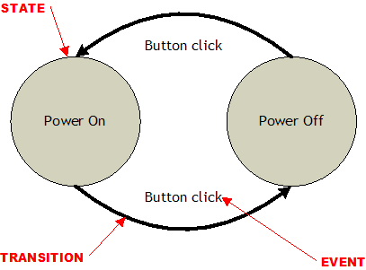

---

## advantages of state machines

* simpler, testable logic
* avoid unhandled events
* no scheduler required

---

## new bot rules

1. bots initialize themselves
2. bots know their own state
3. bots share their state
4. bots change their state in response to events

---

## new bot rules

1. self-configuration
2. persistent state store
3. distributed configuration
4. event-driven response loop

---

## new bot rules

1. sophisticated init code
2. store state in memory
3. write state to etcd
4. watch etcd for changes

---

## patroni

---

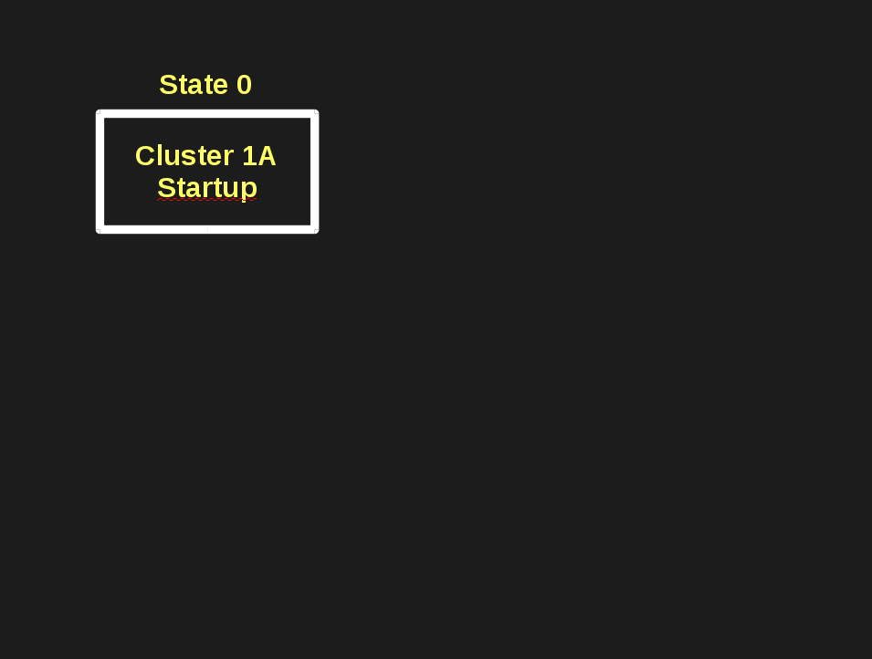

---

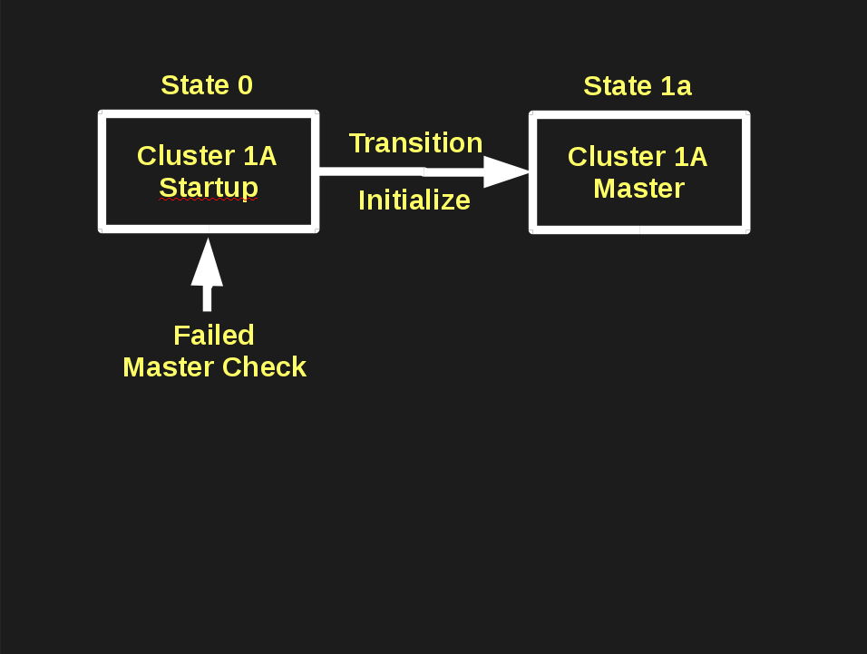

---

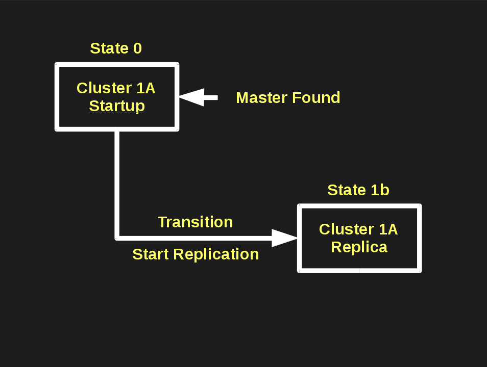

---

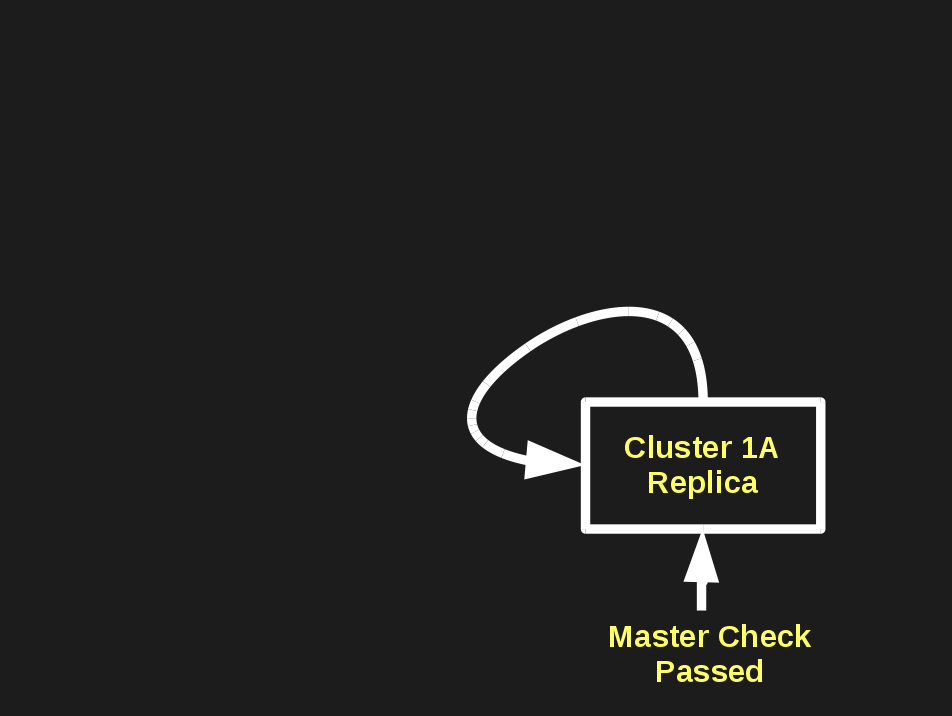

---

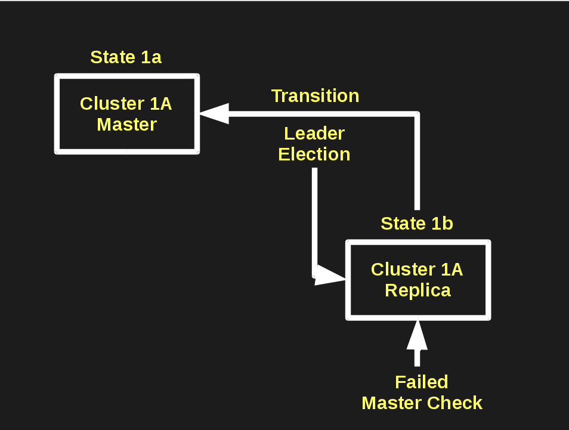

---

## Postgres State Machines

* Patroni / Compose.io
* Manatee / Flynn.io

---

## Other Projects

* mgmt
* Habitat
* Nomad

---

### boticizing

---

## boticizing your app

1. How can it initialize and self-configure?
2. How can it store state about its part of the infrastructure?
3. Use a DCS.
4. Rewrite management as a set of state transitions.

---

## example: web application

Initialization:
1. initialize with etcd connection information and node name
2. query DCS for DB connection & CDN
3. pull new content from git
4. launch
5. update DCS with state

---

## example: web application

Content Response Loop:
1. has there been a git push?
2. if yes, pull new content
3. refresh
4. update DCS with state

---

## example: web application

Load Response Loop:
1. idle node polls for load messages
2. if found: spin up a web server
3. update DCS

---

### problems with bots

---

## bot problems

* lagginess: better event watch
* race conditions: programming, DCS locking
* resource usage: resource events

---

## bot problems

* harder for devs: ¯\_(ツ)_/¯

we're all DevOps now

---

## ¿questions?

.left-column[
more jberkus:

more events:
]

.right-column[
www.projectatomic.io 
@fuzzychef 
jberkus.github.io

KubeCon 
Nov 7, Seattle

Cloud Native PDX Meetup
]

.leftlogo[]

.rightlogo[]
