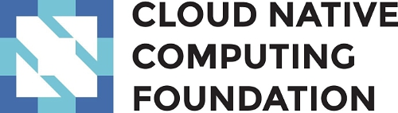
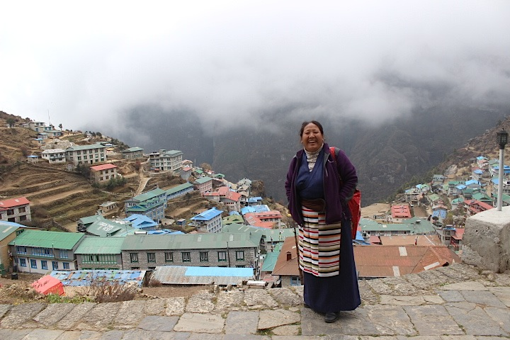
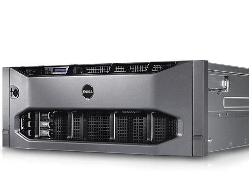
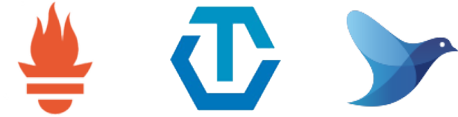
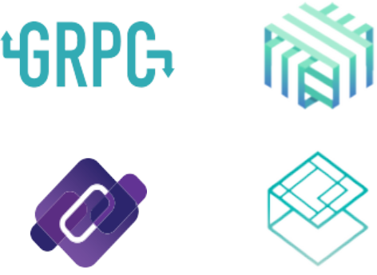
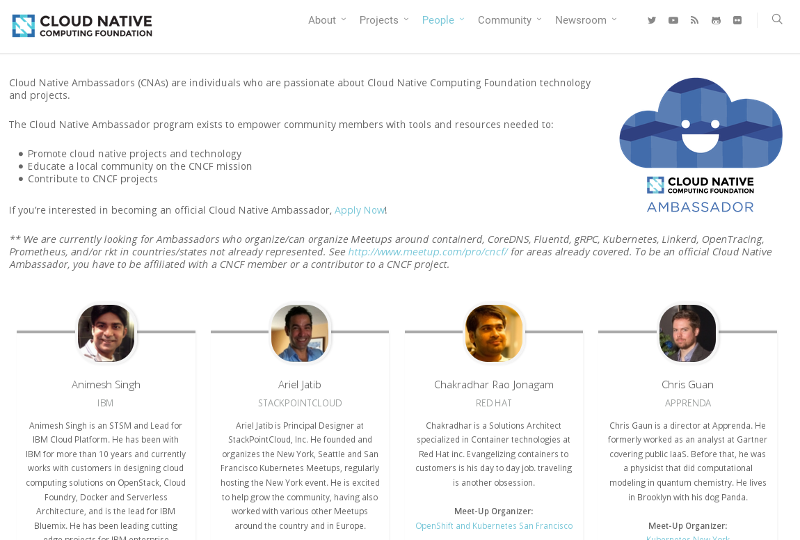

background-image: url(cloud_villiage_2.jpg)

##### A Foundation for Cloud Natives    

.sigblock[
Josh Berkus

CNCF Ambassador

CoreOSFest 2017
]

.leftlogo[]

---

---

## Who's Cloud Native?

---

## Three Tenets

1. container packaged
2. dynamically managed
3. microservices oriented

---

## Cloud 1: Servers

---

## Cloud 1: Servers

---

## Cloud 2: VMs

---

## Cloud 2: VMs

---

## Cloud 3: Containers

---

background-image: url(pipe_maze.jpg)

---

---

#### Why a Foundation?

---

---

## Commons for Cloud Native Code

* Google Kubernetes --> CNCF
* CoreOS rkt --> CNCF
* Treasure Data Fluentd --> CNCF
* Docker containerd --> CNCF

---

## Interoperability

---

#### Projects

---

## Orchestration

---

## Container Runtimes

---

## Observability

---

## Interoperability

---

## CNCF Does

* money
* legal
* events
* doc support
* interop

---

## CNCF Doesn't

* code
* technical gov.
* maintainers

---

#### Getting Involved

---

## Social

* CNCF Slack
* Meetups
* Conferences

https://slack.cncf.io

---

---

## Be an Ambassador

* Start a meetup
* Run an event
* Run a publication

---

## Contribute to projects

* write code
* test
* write documentation
* help with interoperability

---

## Contribute new projects

Grow the Cloud Native commons

---

### Conferences!

---

## Get in touch

.left-column[
web:

slack:

my events:
]

.right-column[
www.cncf.io

slack.cncf.io

www.ContainerDaysPDX.org 
August 3, Portland

Cloud Native Portland 
meetup.com/Cloud-Native-PDX/

]

.leftlogo[]

.rightlogo[]
