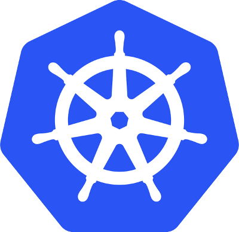

.sigblock[
Josh Berkus

Red Hat

CNPDX June 2017
]

.leftlogo[]

---

### "Lots of great features!"

---

### "Features I don't need are bugs."

---

## Enter CRI-O

* Minimal container runtime
* Fulfills Kubernetes CRI spec 
  _and no more_
* Runs Docker, OCI images
* No daemon
* No CLI

---

## Using CRI-O

1. Build Kubernetes deps with CRI-O 
   _currently from source_
2. Install Kubernetes 
   _using Kubeadm_
3. Run just like Kubernetes+Docker
   _except no Docker ps_

---

## CRI-O Status

* experimental project
* in Kubernetes Incubator
* accepted project in ~6 months?
* open for contributions!

---

## Links

Github:

* /kubernetes-incubator/cri-o
* /cri-o/cri-o-ansible

Project Atomic:

* www.projectatomic.io/blog
* IRC Frenode #atomic

---

## Get in touch

.left-column[
web:

IRC:

my events:
]

.right-column[
www.projectatomic.io

\#atomic

www.ContainerDaysPDX.org 
August 3, Portland

Cloud Native Portland 
meetup.com/Cloud-Native-PDX/

]

.leftlogo[]

.rightlogo[]
