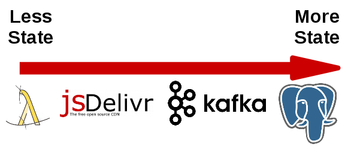
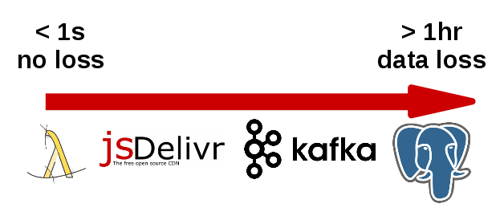
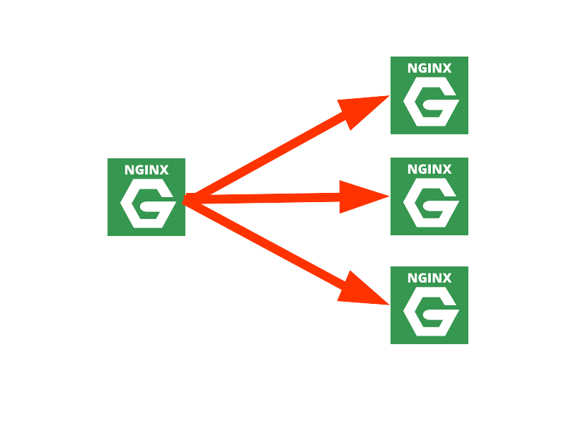
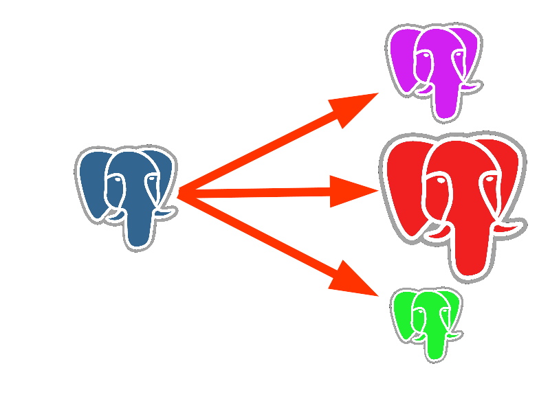

## Deploying with StatefulSet


.sigblock[
Josh Berkus

Red Hat OSAS

Devconf 2017
]

.leftlogo[]

---


---

## Kubernetes StatefulSet

A set of APIs for running stateful applications
in a Linux container cloud.

(aka PetSet)

---

## Code

github.com/jberkus/atomicdb

---


---


---

>The way containers are designed, and particularly the way Docker is designed, the assumption is that the container is stateless. -- Mark Davis, ClusterHQ

---

> Twelve-factor processes are stateless and share-nothing. Any data that needs to persist must be stored in a stateful backing service, typically a database.  12factor.net

---

#### backing store

---

#### AWS RDS

---


---


---


---


---

#### State What?

---

## What is State?

?
?

---

## What is State?

the difference between
code and running applications

---

#### No truly _stateless_ applications

---

## Minimal State

* current task
* memory cache
* cluster deployment

---



### Scale Of State

---



### Switching Cost

---

## Four Types of State

1. Storage
2.   
3.  
4.  

---

## Four Types of State

1. Storage
2. Node Identity
3. Cluster Role
4. Session State

---

## 1. Storage

requirements:

* goes with the container
* exclusive write access

---

## 1. Storage

Solutions:

* automated dir naming
  <br />in app initialization
* network storage
  <br />(allocated per container)
  <br />Kube StatefulSet PVT
* automated data migration
  <br />Flocker Volumes

---

## StatefulSet PVT

* Persistent Volume Template
* Requests new network storage for each pod
* Storage associated with the pod (container)
* Replacements get same storage

---

## StatefulSet PVT

```
volumeClaimTemplates:
- metadata:
    name: pgdata
    annotations:
      volume.alpha.kubernetes.io/storage-class: anything
  spec:
    accessModes: [ ReadWriteOnce ]
```

---

## StatefulSet PVT

```
[root@ip-172-31-47-16 ~]# kubectl get pvc
NAME               STATUS  CAPACITY   AGE
pgdata-patroni-0   Bound   25Gi       59m
pgdata-patroni-1   Bound   25Gi       59m
pgdata-patroni-2   Bound   25Gi       59m
```

---

#### Identity

---



---



---

## Identity Needs

* peering nodes
  <br />etcd, cassandra
  <br />replication slots
* special nodes
  <br />replication master
  <br />reporting nodes
  <br />spares/shadows

---

## Identity Attributes

1. individual
2. durable
3. predictable
4. addressable

---

## StatefulSet Identity

```
[centos@ip-172-31-45-224 ~]$ kubectl get pods
NAME            READY     STATUS    RESTARTS   AGE
etcd-0          1/1       Running   0          5d
etcd-1          1/1       Running   0          5d
etcd-2          1/1       Running   0          5d
patroni-0       1/1       Running   0          2d
patroni-1       1/1       Running   0          2d
patroni-2       1/1       Running   0          2d
patroni-3       1/1       Running   0          2d
patroni-4       1/1       Running   0          2d
```

---

## 3. Cluster Role

what is my job in the cluster?

* replication master
* shard X
* storage bucket Y
* bootstrap node

---

## 3. Cluster Role

* can (does) change
* sometimes exclusive
* leader elections

---

## 3. Cluster Role

DCS to the rescue!

1. DCS shared config
2. DCS leader elections
3. annotations/labels

---

## DCS?

distributed consensus store

* etcd
* consul
* zookeeper
* python-raft

consistent, fault-tolerant

---

## Cluster Role

```
[root@psql-3615923279-dvli8 /]# curl -L
etcd:2379/v2/keys/service/patroni01/members/patroni_2
{
...
{role:master,
 state:running,
 conn_url:postgres://patroni-2.patroni:5432/postgres,
 api_url:http://patroni-2.patroni:8008/patroni,
 xlog_location:67109184}
    }
}
```

---

## Cluster Role

```
kubectl get pods -l patroni-role -L patroni-role
NAME        READY     STATUS       PATRONI-ROLE
patroni-0   1/1       Running      replica
patroni-1   1/1       Running      replica
patroni-2   1/1       Running      master
```

---

## 4. Session State

not everything is a REST request

* downloads
* database transactions
* data state
* auth server sessions

---

## 4. Session State

solutions?

* discovery DNS
  <br />but ... need IP migration cost
* smart proxies
  <br />but ... need reconnect logic

---

## Session State

```
psql -h pgwrite.patroni.default.svc.cluster.local
psql -h pgread.patroni.default.svc.cluster.local
```

---

## ¿questions?

.left-column[
more<br />jberkus:


more<br />events:
]

.right-column[
www.projectatomic.io<br />
@fuzzychef<br />
jberkus.github.io

FOSDEM<br />
Feb. 4, Brussels

KubeCon EU
<br />Mar. 28, Berlin
]

.leftlogo[]

.rightlogo[]
