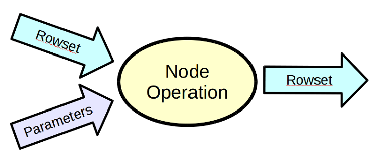
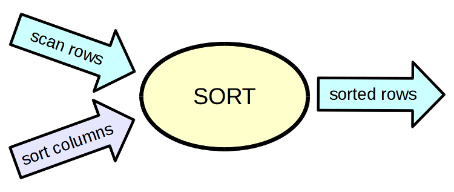
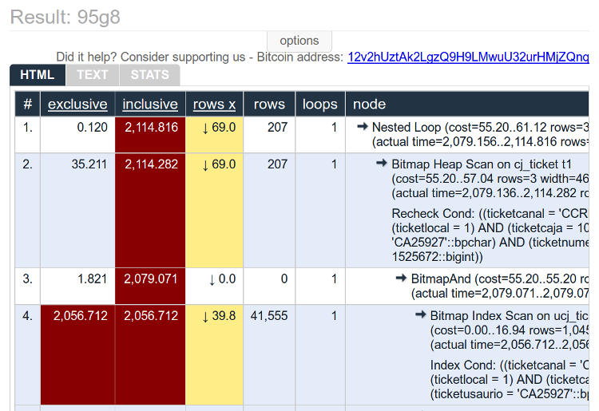
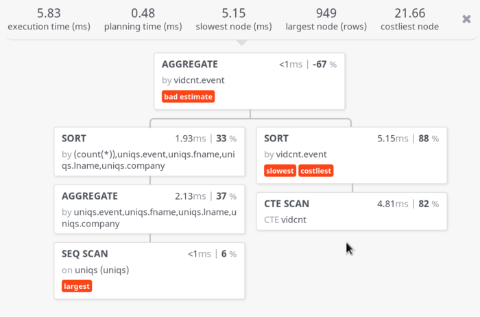

background-image: url(explain_screenshot2.png)

#### EXPLAIN<br>*explained*

.sigblock[
Josh Berkus

Red Hat OSPO

Dec. 2020
]

.leftlogo[]

---


---

name: titleslide
background-image: url(explain_screenshot2.png)

#### ¿explain wut?

---

name: titleslide
background-image: url(timeout.png)

---

## timeout troubleshooting

1. figure out which requests are slow
2. trace those requests
3. find out database calls are slow
4. find which DB request is slow
5. ?????

---

SELECT ID, name, email
FROM patrons
JOIN holds ON patron.id = holds.patron_id
WHERE overdue;

### 5. you need a query

---

```
const prisma = new PrismaClient({
  log: ['query']
});
```

---

```
log_destination = 'csvlog'
logging_collector = on
log_directory = '/path/to/log/dir'
log_min_duration_statement = 500
log_rotation_size = 1GB
```

---

name: titleslide
background-image: url(explain_screenshot2.png)

#### then, EXPLAIN

---

## what explain does

lets you know **what** the query planner chose to do

gives you stats on **how** the query was executed

implies reasons **why** a query was slow

tells you **which** step in the query took the most time

---

## what explain doesn't do

tell you **why** a particular index isn't used

explain **how** to rewrite your queries

show **what** other factors make the DB slow

tell you **how much** time the request took outside the DB

---

## the query planner

1. break the query down into atomic "nodes"
2. figure out every possible way to execute each "node" and its cost
3. chain the combinations together into plans
4. calculate the total "cost" of each plan
5. pick the plan with the lowest "cost"

(originally written in lisp)

---



### nodes

---



### sort node

---

```
Sort  (cost=146.63..148.65 rows=808 width=138)
  (actual time=55.009..55.012 rows=71 loops=1)
  Sort Key: n.nspname, p.proname,
    (pg_get_function_arguments(p.oid))
  Sort Method: quicksort  Memory: 43kB
```

---



### explain.depesz.com

---



### tatiyants.com/pev

---

## $cost$

*A figure in completely arbitrary cost units (float)
which is intended to represent estimated time and
system resources required to execute the query
based on dubious theory and proven practice*

(some people adjust seq_page_cost)

---

```
select card_no, first_name, last_name
from patrons where card_no = 22827268400294;

Index Scan using patrons_pkey on patrons
   (cost=0.28..2.50 rows=1 width=24)                                                                                 
   Index Cond: (card_no = 22827268400294::numeric)
```

---

## EXPLAIN vs EXPLAIN ANALYZE

**EXPLAIN** shows what the planner planned to do.

**EXPLAIN ANALYZE** shows the plan, executes the query,
and also shows how it did.

*Important: EXPLAIN ANALYZE UPDATE will update the data!*

---

```
Index Scan using patrons_pkey on patrons  
    (cost=0.28..2.50 rows=1 width=24)
    (actual time=0.027..0.028 rows=1 loops=1)
Index Cond: (card_no = 22827268400294::numeric)
Planning time: 0.184 ms
Execution time: 0.079 ms
```

---

## EXPLAIN VS EXPLAIN ANALYZE

Most of the time, you want EXPLAIN ANALYZE, unless:

* the query never finishes
* you're just checking index usage
* you're just checking partition scans

---

## other EXPLAIN options

* buffers
* costs & timing
* format (yaml, xml, json)
* verbose

```
explain ( analyze on, verbose on, format yaml )
```

---

## buffers

```
explain (analyze on, buffers on)
select * from people
where details @@
  'attributes.attr3 = "value4"'::jsquery;

Bitmap Heap Scan on people  
  (cost=45.94..5825.51 rows=3515 width=819)
  (actual time=56.013..13891.954 rows=66812 loops=1)
  Recheck Cond: (details @@ '"attributes"."attr3" = "value4"'::jsquery)
   Heap Blocks: exact=62156
   Buffers: shared hit=18145 read=69783
   ->  Bitmap Index Scan on people_jsquery  
       (cost=0.00..45.06 rows=3515 width=0)
       (actual time=38.243..38.243 rows=66812 loops=1)
         Index Cond: (details @@ '"attributes"."attr3" = "value4"'::jsquery)
         Buffers: shared hit=1 read=39
Planning time: 15.035 ms
Execution time: 13919.004 ms

```

---

## yaml

```
libdata=# explain ( analyze on, format yaml )
select card_no, first_name, last_name
from patrons where card_no = 22827268400294;

- Plan:
    Node Type: "Index Scan"
    Scan Direction: "Forward"
    Index Name: "patrons_pkey"
    Relation Name: "patrons"
    Alias: "patrons"
    Startup Cost: 0.28
    Total Cost: 2.50
    Plan Rows: 1
    Plan Width: 24
    Actual Startup Time: 0.030
    Actual Total Time: 0.030
    Actual Rows: 1
    Actual Loops: 1
    Index Cond: "(card_no = 22827268400294)"
    Rows Removed by Index Recheck: 0
  Planning Time: 11.532
  Triggers:
  Execution Time: 0.097
```

---

## verbose

```
Nested Loop  (cost=1.79..21.52 rows=16 width=28)
  (actual time=0.101..0.203 rows=24 loops=1)
Output: patrons.card_no, patrons.last_name,
  patrons.first_name, loans.copy_id
 ->  Index Scan using patrons_pkey on public.patrons
     (cost=0.28..2.50 rows=1 width=24)
     (actual time=0.018..0.020 rows=1 loops=1)
        Output: patrons.card_no, patrons.first_name,
        patrons.middle, patrons.last_name,
        patrons.address, patrons.city,
        patrons.state, patrons.birthdate,
        patrons.status, patrons.issued_on
        Index Cond: (patrons.card_no = 22827268400294)
   ...
```

---

background-image: url(explain_screenshot2.png)

#### Reading EXPLAIN

---

## inverted tree

```
 Nested Loop  (cost=1.79..21.52 rows=16 width=28)
   ->  Index Scan using patrons_pkey on patrons
       (cost=0.28..2.50 rows=1 width=24)
         Index Cond: (card_no = 22827268400294)
   ->  Bitmap Heap Scan on loans  
       (cost=1.51..18.86 rows=16 width=14)
         Recheck Cond: (card_no = 22827268400294)
         ->  Bitmap Index Scan on loan_patron  
             (cost=0.00..1.51 rows=16 width=0)
               Index Cond:
                 (card_no = 22827268400294)
```

---

## first

```


         ->  Bitmap Index Scan on loan_patron  
             (cost=0.00..1.51 rows=16 width=0)
               Index Cond:
                 (card_no = 22827268400294)
```

---

## second

```

   ->  Index Scan using patrons_pkey on patrons
       (cost=0.28..2.50 rows=1 width=24)
         Index Cond: (card_no = 22827268400294)
   ->  Bitmap Heap Scan on loans
       (cost=1.51..18.86 rows=16 width=14)
         Recheck Cond: (card_no = 22827268400294)


.
```

---

## third

```
Nested Loop  (cost=1.79..21.52 rows=16 width=28)


.
```

---

## one line of EXPLAIN

```
Index Scan using patrons_pkey on patrons
  (cost=0.28..2.50 rows=1 width=24)
  (actual time=0.015..0.015 rows=1 loops=1)
  Index Cond: (card_no = 22827268400294::numeric)
```
---

## operation

```
Index Scan using patrons_pkey on patrons


.
```
---

## cost

```

  (cost=0.28..2.50 rows=1 width=24)

.
```

---

## first

```


              cost=0.00..1.51

.
```

---

## second

```


        cost=0.28..2.50


        cost=1.51..18.86


              cost=0.00..1.51

.
```

---

## third

```
               cost=1.79..21.52

        cost=0.28..2.50


        cost=1.51..18.86


              cost=0.00..1.51

.
```

---

## actual

```


  (actual time=0.015..0.015 rows=1 loops=1)
.
```

---

## loops

```


  (actual time=0.015..0.015 rows=7 loops=1258)
.
```

---

## conditions

```


  Index Cond: (card_no = 22827268400294::numeric)

```
---

background-image: url(explain_screenshot2.png)

#### Node Types

---

## scans

**SeqScan**: full table scan

**Index Scan**: scan index, look up tuples in table

**Index-Only Scan**: scan index, ignore heap

**Bitmap Scan**: scan index, build bitmap of compliant rows

.center[Most will contain a filter condition]

---

```
Bitmap Heap Scan on loans  
 (cost=1.51..18.86 rows=16 width=14)
 (actual time=0.016..0.031 rows=24 loops=1)
    Recheck Cond: (card_no = 22827268400294)
    Heap Blocks: exact=10
    ->  Bitmap Index Scan on loan_patron  
        (cost=0.00..1.51 rows=16 width=0)
        (actual time=0.010..0.010 rows=24 loops=1)
        Index Cond: (card_no = 22827268400294)
```

---

## joins

**NestLoop**: for each row in set A look up the rows in set B

**Hash Join**: Make a hash table of set A and match groups of rows in set B

**Merge Join**: sort both set A and set B, then "zip" them together

---

# more joins

**Lateral Join**: join against table expressions

**Semi-Join**: partial join, for outer join

**Anti-Join**: exclusion, such as for NOT IN()

---

```
Hash Join (cost=1.60..32,729.73
           rows=23,490 width=73)
  (actual time=0.028..45.925
   rows=58,915 loops=1)
  Hash Cond: (stl.source_id = src.id)


Merge Join (cost=43,421.29..7,091,238.82
            rows=117,347 width=1,628)
  (actual time=2,113.472..30,963.212
   rows=30,068,832 loops=1)
  Merge Cond:
    (dlag.dienstleister_id_fk = dl.id)
```

---

## aggregates

**GroupAggregate**: regular aggregation

**HashAggregate**: in-memory aggregate using hash tables

**WindowAgg**: used for windowing clause expressions

---

```
 HashAggregate  (cost=1081.99..1096.48
                 rows=1449 width=24)
           (actual time=65.711..65.886
                 rows=1415 loops=1)
   Group Key: patrons.card_no, patrons.last_name,
     patrons.first_name

GroupAggregate  (cost=21.84..22.09 rows=1 width=32)
   Group Key: patrons.card_no, patrons.first_name,
     patrons.last_name

```

---


## other operations

**Unique**: deduplicate rows, like for DISTINCT or UNION

**Sort**: what it says on the tin

**Limit**: supports LIMIT/OFFSET

---

## other operations

**CTEScan**: joins a CTE (WITH clause) to the main query

**SubqueryScan**: same, but for subqueries

**Materialize**: create a recordset in memory from a query fragment

**Append**: merge rowsets for UNION ALL and partitions

---

```
CTE Scan on totab
  (cost=20,000,033,207.81..20,000,033,207.84
   rows=1 width=672)
  (actual time=3,058.798..3,090.778
   rows=4 loops=1)
    Filter: (((pnl_abnset IS NULL) OR
      (pnl_theo IS NULL)) AND (biterror = 0))
    Rows Removed by Filter: 37825
```

---

background-image: url(explain_screenshot2.png)

#### why is my query slow?

---

# needs an index

```
Seq Scan on reseau_montreal
  (cost=0.00..78,194.57 rows=206,573 width=1,057)
  (actual time=0.009..531.356 rows=148,811 loops=1)
    Filter: (categorie = 7)
    Rows Removed by Filter: 35030
```
---

# bad row estimate

```
Index Scan using
  testowy_index_original_package on original
  (cost=0.00..426.68        rows=108    width=8)
  (actual time=0.033..8.767 rows=10,982 loops=1)
     Index Cond: (package_id = package.id)
```

---

# time-consuming loops

```
Nested Loop (cost=0.00..822.35 rows=77 width=4)
  (actual time=0.076..54.759 rows=10,957 loops=1)

Index Scan using
  testowy_index_movie_original on movie
  (cost=0.00..4.94 rows=1 width=8)
  (actual time=0.003..0.003 rows=1 loops=10,982)
    Index Cond: (original_id = original.id)

```

---

# using explain to test query plans

1. run EXPLAIN

2. change a parameter or stats:

    SET enable_nestloop = off;<br />
    ALTER ... SET STATISTICS 1000;<br />
    ALTER ... SET ( n_distinct = ? )

3. run EXPLAIN again

---

```
Limit  (cost=1613.10..1613.15 rows=20 width=194)
       (actual time=0.503..0.509 rows=20 loops=1)
->  Sort  (cost=1613.10..1736.14 rows=49215 width=194)
    (actual time=0.502..0.505 rows=20 loops=1)
        Sort Key: categories.recorded_on
    Sort Method: top-N heapsort  Memory: 30kB
    ->  Nested Loop  
        (cost=248.80..303.51 rows=49215 width=194)
        (actual time=0.069..0.347 rows=81 loops=1)
        ->  HashAggregate  
            (cost=248.80..248.81 rows=1 width=4)
            (actual time=0.050..0.054 rows=8 loops=1)
            ->  Index Scan using unique_index_tags on tags
                (cost=0.00..248.54 rows=103 width=4)
                (actual time=0.020..0.033 rows=8 loops=1)
                Index Cond: (from_user_id = 53529975)
        ->  Index Scan using
            index_categories_on_user_id on categories  
            (cost=0.00..54.34 rows=29 width=194)
            (actual time=0.010..0.028 rows=10 loops=8)
                Index Cond: (user_id = tags.to_user_id)
Total runtime: 0.641 ms
```

---


### explain.depesz.com

---


### tatiyants.com/pev

---

# other GUIs and helpers

* pgAdmin Visual Explain<br />
  part of pgAdmin GUI
* pgAnalyze explain plan
* irc.freenode.net, #postgresql

---

# ¿questions?

.left-column[
more<br />jberkus:


more resources:
]

.right-column[
@fuzzychef<br />
jberkus.github.io

explain.depesz.com<br />
https://wiki.postgresql.org/wiki/Using_EXPLAIN<br />
www.pgadmin.org<br />
]

.leftlogo[]

.rightlogo[]
