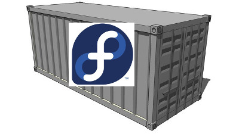
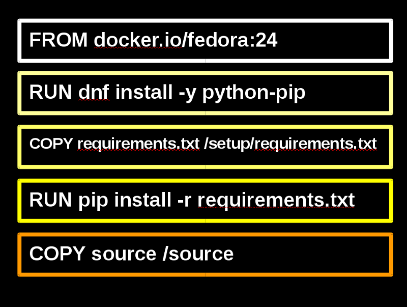

#### Building a Fedora<br />Container Images Collection



.sigblock[
Josh Berkus

Red Hat OSAS

Fedora Flock 2016
]

.leftlogo[]


---

## Plan

1. Goals for the Project
2. Containers vs. Images vs. Apps
3. Building Good Images
4. Building Refinements
5. Atomic CLI

---

## Not Covering

* system containers
* container security
* Kubernetes

---

# Goal: Take Back The Cloud

---

## Problem #1

* Fedora is the base for < % of images on Docker Hub
* Containers are the new application packaging
* Developers aren't targeting Fedora

---

## Problem #2

* New cloud based on Fedora Atomic & OpenShift
* Few applications to run on it
* Limited adoption of the new platform

---

## Solution: image-building

* Lots of Fedora-based application images
* _Superior Images_
* Create pipeline for Atomic/OpenShift

---

# Build good images

---

# Containers, Images, Microservices, and Apps

---

## What's an Image?

---

## What's an Image?

A package for distributing containerized applications

---

## What's an Image?

A package for distributing containerized applications

_A (layered) filesystem with some metadata_

---

## What makes a good image?

* Good filesystem
* Really good metadata

---

## Images and Containers


* images are a template
* think about deployment

---

## Microservice

---

## Microservice

_The smallest reasonable application component, delivered as a service with an API_

---

### Apps and Microservices

* multiple microservices make up one app
* some services may scale independantly
* app is app regardless of scale

---

# Building Images

---

## Building Methods

* Dockerfiles
* Ansible-Container
* Source2Image (OpenShift)

---

# Dockerfile Exercise

---



---

## Base Images

* Use official Fedora Images
* use fedora:24 or fedora:23
* do not use Fedora:latest

---

## Layering Images

_consider using a layered image_

Examples:

* Python image for Python app
* Flask image for Flask + modules
* Postgres image for PostGIS

---

## Dockerfile Refinements

* limiting layers
* cleaning up cache
* ENV
* volumes
* USER
* CMD, Entrypoint
* logging

---

# Dockerfile Refinements

---

# CMD vs. Entrypoint

```
CMD ["/usr/bin/python", "-m", "SimpleHTTPServer"]
```

---

# CMD vs. Entrypoint

```
ENTRYPOINT ["/usr/bin/python"]
CMD["-m", "SimpleHTTPServer"]
```

---

## Entrypoint Scripts

* keep them simple
* ENV-driven
* use exec
* consider using systemd?

---

## Labels

* Labels for Fedora Layered Images
* Labels for Atomic CLI
* Labels for OpenShift

---

## Fedora Layered Image Service

---

## Atomic CLI

* More advanced way to pull images
* Automates running images with requirements

---

# Pushing to Registries

---

## What's a Registry?

Stores image metadata and labels

May also provide a catalog

---

## Registries

* Docker Hub
* Quay.io (CoreOS)
* OpenShift
* Atomic Registry (TBD

---

## Versioning and Tagging

```
registry  /  (owner)    /  image   :  tag
docker.io /  jberkus    /  postgres:  9.5
docker.io /                fedora  :  24
quay.io   /  coreos     /  etcd    :  latest
```

---

## Image Documentation

* Authors
* Directions on use
* List of ENV variables
* Volumes
* List of included software
* Location of repository

---

# Tag and Push

---

# Image Documentation

---

# What About Apps?

---

## App == Collection

* One or more containers
* Required setup info for Ops

---

## ansible-container vs. AtomicApp

* Use ansible-container to build images
* Use AtomicApp to deploy containers

---

## AtomicApp & Nulecule Spec

* configuration file for AtomicApp
* contains information for all containers
* Docker, Kubernetes, OpenShift

---

# AtomicApp/Nulecule

---

## ¿questions?

.left-column[
more<br />jberkus:


more<br />events:
]

.right-column[
www.projectatomic.io<br />
@fuzzychef<br />
jberkus.github.io

LinuxCon<br />
Aug 23, Toronto

KubeCon<br />
Nov 7, Seattle
]

.leftlogo[]

.rightlogo[]
