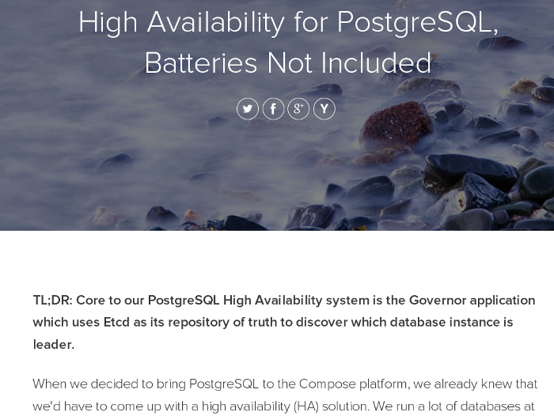
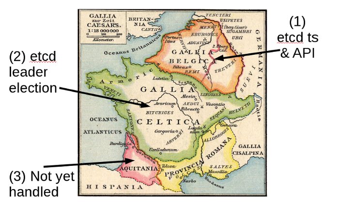
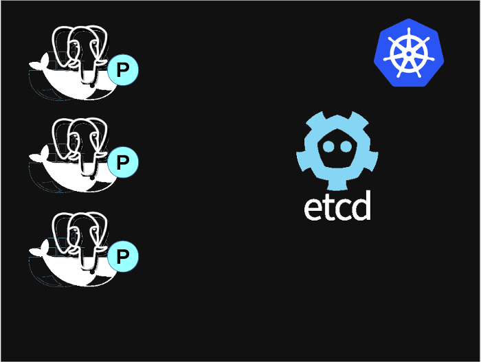
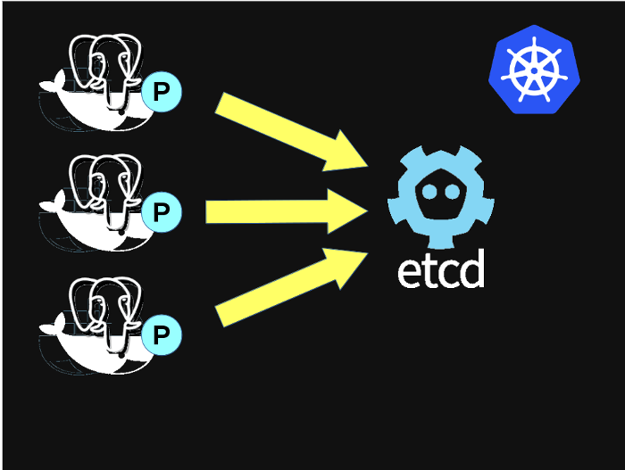

.left-column[

]

.right-column[

##### Full Auto Database

]

.sigblock[
Josh Berkus

Red Hat Project Atomic

KubeCon.EU 2016
]

.leftlogo[]

---

---

---

## WIP: waiting for 1.2/1.3

---

---

#### Demo

---

## Single Master DBs: Problem

* low availability
* unidirectional replication
* very manual HA solutions

---

## Why not multi-master DBs?

just moving the problem around

* "eventual" consistency
* network lag
* maturity issues
* feature poverty
* app compatibility

---

## But PG Replicaton is Awesome!

* Easy to set up
* Guaranteed
* Corruption-free
* Anti-footgun
* Combines with DR

---

### Y U No Failover?

---

#### "Automated failover is too complicated.  You don't want it."

---

#### NO!

---

## Hard != Impossible

---

## Hard != Impossible

_general_ autofailover is prohibitive

but ... we can implement common use cases

---

## The 80% Solution

1. Pool of async replicas
2. Cheap/replacable nodes
    Containers
3. Watchdog service
4. Auto-promote one replica
5. Other nodes remaster
6. Update routing

---

## Now, a little history ...

---

## Handyrep

* master-controller architecture
* based on Python Fabric + SSH
* worked in production
* worked with any Postgres config
* pluggable

www.handyrep.org

---

## Handyrep: _too general_

* Difficult to install
* Difficult to debug
* Over 100 configuration options
* Scaled poorly
* HR server was SPoF

---

## Zalando

* no1 European online fashion
* 15m customers
* 150 databases
* 24/7/365 operation

... needed automated, decentralized HA

---

## Failover Failure

.left-column[

]

.right-column[

* False failover
* Misfires
* Race conditions

]

---

---

## Split Brain and S-M DBs

* worst possible outcome
* automated recovery impossible
* manual recovery painful

---

### Patroni

---

---

1. Postgres is a poor store of its own replication state
2. Smart agents > top-down controllers

---

## Compose Governor

* Containers
* Etcd-based consensus
* Simple PostgreSQL controller

... so we forked it.

---

# How it works

---

### failover est omnis divisa in partes tres

---

### failover est omnis divisa in partes tres

---

## The Patroni Controller

---

## Patroni controller

* Python daemon
* Runs in each container as PID 1
* Controls Postgres startup/shutdown/config
* Provides external REST API
* Enforces opinionated config

---

## Patroni Failover

 leader

---

## Patroni Failover

---

## Patroni Failover

---

## Patroni Failover

---

## Patroni Failover

---

## Patroni Failover

---

## Patroni Failover

---

## Patroni Failover

---

## Patroni Failover

---

## Patroni Failover

---

## Patroni Failover

---

## Patroni Failover

---

## Patroni Failover

---

## Patroni Failover

---

## Patroni Failover

---

### What about split-brain?

---

## Etcd

* distributed consensus HTTP data store
* Raft algoritm
* implements CA
* great for config + metadata
    * not for data data

---

## Etcd Alternatives

* Zookeeper
    * larger scale
    * supported
* Consul
    * integrates discovery
    * not (yet) suppported

---

## What's AtomicDB?

_WIP project_

* PostgreSQL
* Patroni
* Atomic Host
* Kubernetes
* Dynamic proxy (dev)
* Cockpit UI (dev)

---

#### Let's see that again

---

## The Proxy Problem

* differentiate master and read-only connections
* master service needs to follow failover
* failover logic too complex for kubernetes (1.1)

---

## pgbouncer?

* current implementation in pgbouncer
* master, read slaves separate services/ports
* depends on flannel LB

_not good enough.  Waiting for 1.2/1.3!_

---

## More features

* pg_rewind support (9.4+)
* configurable node imaging
    * WAL-E
    * PITR
* synchronous replication
* non-failover replicas

---

## More Stuff Under development

* cascading replication
* integrated proxy
* BDR support?

_fork us on Github!_

---

## Resources

* This Presentation:
   jberkus.github.io/full_auto_db
* Patroni Project:
   github.com/zalando/patroni
* AtomicDB Project:
   github.com/jberkus/atomicdb

---

# ¿questions?

.left-column-narrow[
more jberkus:

project atomic:

&nbsp;
]

.right-column-wide[
@fuzzychef 
www.databasesoup.com 

www.projectatomic.io
_RedHat booth for Cockpit Kube demo_
&nbsp;
]

.leftlogo[]

.rightlogo[]
