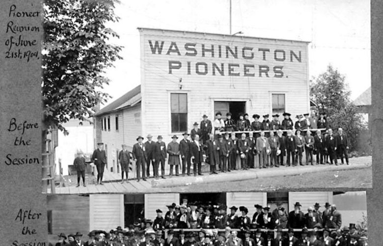
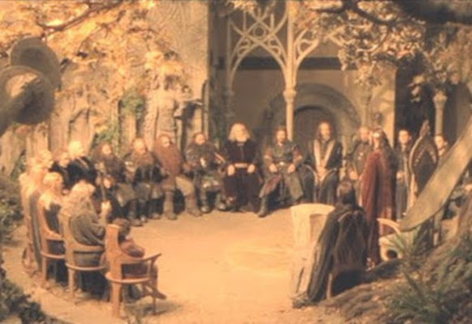
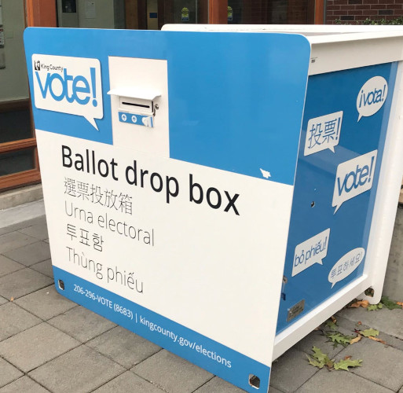
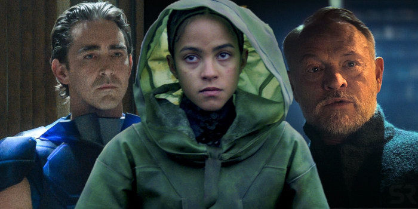

background-image: url(olympia2.jpg)

#### Governance  

#### *6 types and 3 models*

.sigblock[
Josh Berkus

Red Hat OSPO

SeaGL 2021
]

.leftlogo[]

---

# Me & Gov

* Red Hat OSPO
* CNCF TAG Contributor Strategy 
* Election maven (Elekto project)
* Charter writer for 20+ years

twitter: @fuzzychef

---

# You & Gov

You are one of:

1. Project leader/founder
2. Project contributor
3. Community manager
4. OSPO staff
5. Governance geek
6. Just curious

---

name: titleslide
background-image: url(olympia2.jpg)

#### Who cares about governance?

---

# Users

* Project continuity
* Insight into changes

---

# Contributors

* Fairness
* Input into roadmap
* Ability to advance

---

# Project Leaders

* Reducing arguments
* Can vacation/retire

---

name: titleslide
background-image: url(olympia2.jpg)

#### What is Governance?

---

Elections?

Git management?

Legal ownership?

Moderation guidelines?

---

## *Who gets to, or has to, do what, when and how*

---

# Two Parts of Governance

1. **Roles**

2. **Processes**

---

# Roles

The "who"

A defined "job" in the project, with *requirements*, *duties*, and *privileges*

* maintainer
* doc contributor
* project member
* event runner

---

# Processes

The "what"

A defined "recipe" in the project, with *timing*, *steps* and *results* that brings together several *roles*.

* PR approval steps
* meeting agenda
* election procedure
* CoC violation report

---

name: titleslide
background-image: url(olympia2.jpg)

#### Six Types of Governance

---

# 1. "None"

---

# 1. "None"

"There is no governance, just writing code."

Also called:

* "Do-ocracy"
* "Just submit a PR"

---

# All Projects Have Governance

Someone approves PRs

Someone decides roadmap

Someone manages project resources

---

# 1. "None"

... means governance is *implicit*

Difficult to get started

Watch member interactions to find real governance

---

# 2. Founder-Leader

---

# 2. Founder-Leader

The original creators of the project are the sole authority.

Also called:

* "Benevolent Dictator For Life (BDFL)"
* "none"

---

# 2. Founder-Leader

* join project through the founders
* roadmap?  Ask founders
* no replacement of leaders
* larger F-L have "lieutenants"
* often no gov docs

---

# 3. Council

---

# 3. Council

A committee leads the project and selects its own replacements.

Also called:

* "maintainer council"
* "core team"

---

# 3. Council

* often an F-L project that matured
* key roles filled by council
* replacement is slow, but happens
* formal meetings and governance decisions (may be secret)
* light gov docs

---

# 4. Electoral

---

# 4. Electoral

Community in which leaders and some other roles are elected by vote of members

Also called:

* "steering committee"
* "democratic"

---

# 4. Electoral

* both elected and unelected roles
* frequent replacement
* much more governance docs
* project member role critical
* more community overhead

---

# 5. Corporate-Control

---

# 5. Corporate-Control

Project mirrors a host company's hierarchy, decisions, and goals.

Also called:

* "inner source"
* "customer/partner community"
* "user community"

---

# 5. Corporate-Control

* all senior roles are employees
* roadmap is secret or read-only
* can be a consortium
* legit if honest about it
* gov docs vary, often scarce

---

# 6. Foundation

---

# 6. Foundation

Leadership of the project resides in an independent non-profit organization.

Also called:

* "incorporated project"
* "community-owned"

---

# 6. Foundation

* tends to complex, multi-layer gov
* **lots** of gov docs
* tiers of councils/elections/F-L teams
* larger projects or ecosystems
* some are corporate-controlled

---

name: titleslide
background-image: url(olympia2.jpg)

#### Three Templates

---

# Templates for Projects

From CNCF Contributor Strategy

"Minimum Viable Governance" (MVG)

We create templates for the three most common models we saw in the CNCF.

---

# Parts of an MVG template

1. Values
2. Leadership Definition
3. Communications
4. Powers (delegation)
5. Requirements
6. Decision-Making

---

# A. Maintainer Council

*Implements the "Council" governance structure.*

* simplest template
* applicable to most projects

---

# B. Steering Elections

Implements a simple elected Steering Committee.

* for bigger projects
* establishes concept of membership
* requires Contributor Ladder

---

# C. Federation

Implements a two-tier structure for projects with subprojects.

* for "ecosystem" projects
* different governance at each level
---

# Conclusions

* governance is important to the stakeholders of your project
* there are common structures used by many projects
* initial governance can (and should) be documented using common templates

---

# ¿questions?

.left-column[
more jberkus:

more resources:
]

.right-column[
@fuzzychef 
jberkus.github.io

contribute.cncf.io/maintainer 
github/cncf/project-templates 
fossgovernance.org 
]

.leftlogo[]

.rightlogo[]
