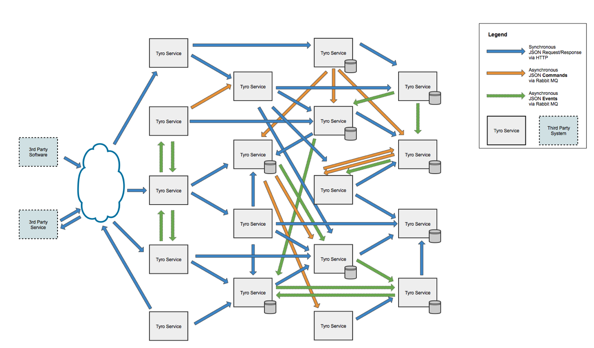
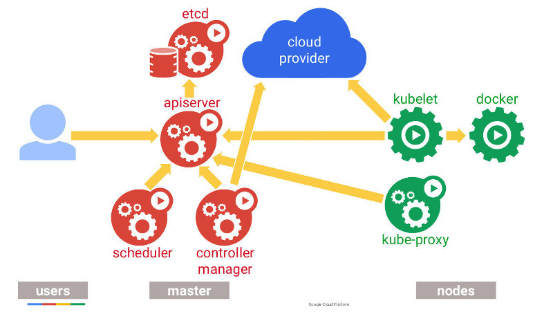

#### Kubernetes 101

.sigblock[
Josh Berkus

Red Hat OSAS

SCALE 15x
]

.leftlogo[]

---

#### Thanks

Jerome Petrazzoni, Dusty Mabe, Mike Dorsey, Carter Morgan, SCALE 15x Crew!

---

## Who this is for:

* know what Docker is
* maybe used containers in dev
* don't know much about orchestration

---

---

## Kubernetes: History

1. Google created OSS port of internal code
2. Made it compatible with Docker
3. Donated to CNCF as project
4. Red Hat, CoreOS contributing

---

### Powered by Kubernetes

---

#### microservices

---

#### One Container One Service

---

#### One App Many Containers

---

## Microservice Django

1. PostgreSQL containers (w/ replicas)
2. pgbouncer container
3. Storage containers (Gluster)
4. Django containers
5. Webserver container (nginx)
6. Reverse proxy container
7. DB backup container
8. CI container

---

---

---

## Microservice Coordination

* BASH?
* Puppet/Ansible?
* Custom Python/Ruby code?
* Typing real fast?

---

---

### Pods

---

## What's a pod?

* Group of containers
* Deploy together
* Share an IP address, ports
* Share storage

---

#### How do I deploy my containers?

---

## deployment: nodes

* node == machine (hw/vm)
* several nodes in a cluster
* each node runs "kubelet"

---

#### I need to scale out

---

## scaling out: replicas

---

## scaling out: replicas

* scale services with duplicate pods
* kubernetes "scheduler" places them

---

#### How do I access my apps?

---

## sharing: services

* with other pods in the cluster (DB)
* with external networks (web)

---

## sharing: ingress

* URL "path" access to services
* requires controller & DNS
* supports TLS/HTTPS

---

#### But I need to configure my apps

---

## configuration

* dev vs. prod
* multi-tenant apps
* passwords
* performance settings

---

## configuration options

* ENV
* ConfigMap
* Secrets

---

#### What about stateful services?

---

## storage: volumes

* Volumes: local storage per node
* PersistentVolumes: shared storage on network storage

---

## beyond volumes: StatefulSet

* persistent pod identity
* pod addressability
* associate storage with specific pods

(see my presos tommorrow & sunday)

---

#### How do I maintain my apps?

---

## maintenance with Deployments

* represents an "instance" of an app
* supports rolling updates
* also: Canary, Blue/Green, etc.

---

## Deployment pattern

1. create initial deployment with service + replicas
2. edit deployment at update time
3. roll out new version
4. roll back on fail

---

#### Implementation Details

---

## how does all this work?

---

## etcd

* distributed consensus store
* holds metadata
* supports HA for Kube itself

---

## create & edit objects

* write direct to etcd
* kubectl one-liners
* kubectl + yaml files
* API + drivers (e.g. pyKube)

---

## other pieces (microservices)

* apiserver: provides API
* scheduler: places pods
* controller: starts/stops pods
* proxy/network: lets pods connect
* discovery: find pods by name
* dns: lets outside connect

---

## recap: what Kube does

* grouping: pods
* deployment: nodes
* scale-out: replicas
* sharing: services
* configuration
* storage: volumes
* maintenance: deployments

---

## other Kube things

* federation (multi-DC)
* Helm for apps
* operators
* alternate runtimes (rkt, cri-o)

---

## recap: what Kube does

allows you to turn a set of containers into an application

---

## ¿questions?

.left-column[
more jberkus:

more events:
]

.right-column[
www.projectatomic.io 
@fuzzychef 
jberkus.github.io

Friday: PG + Kubernetes 
Sunday: StatefulSets

KubeCon 
March 26, Berlin

]

.leftlogo[]

.rightlogo[]
