## Kube-Native Postgres


.sigblock[
Josh Berkus

Red Hat OSAS

KubeCon US 2017
]

.leftlogo[]

---


### Thanks, Zalando!

---

## goals

Make deploying PostgreSQL on Kubernetes as boring as deploying Nginx

---

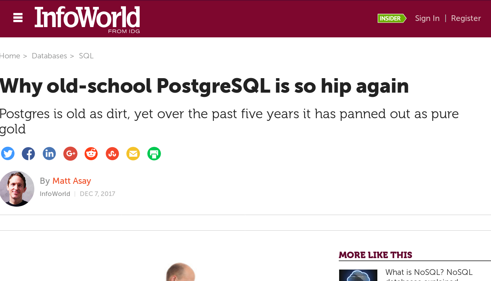

---

> [developers] are also glomming onto the virtue of boredom: As one person posted at Hacker News, "It's not hip and takes a bit to set up, but after you are done, you have a reliable workhorse with all the stuff you need."

---

> [developers] are also glomming onto the virtue of boredom: As one person posted at Hacker News, "It's not hip ~~and takes a bit to set up~~, but after you are done, you have a reliable workhorse with all the stuff you need."

---

## menu du jour

* explain patroni
* patroni: the old way
* patroni: kube-native
* patroni operator
* other examples: crunchy operator

---

## what changed?

1. tighter kube integration
2. operator
3. in production

---

## some terms

Postgres: a database

Patroni: an HA daemon

Spilo: a container image containing both of the above, plus utilities

---

## Patroni

in-container daemon that:

* controls PostgreSQL start/stop/replication
* automates failover
* supplies a management API

---

# why?

1. Simplicity
2. Usability
3. Availability

---

## simplicity goals

* One container image
* Rely on Kubernetes
* "just works" defaults

---

## useability

* Management port (8008)
* Configuration & plugins
* No limitations on Postgres

---

## availability

Fully automated replication and failover

---

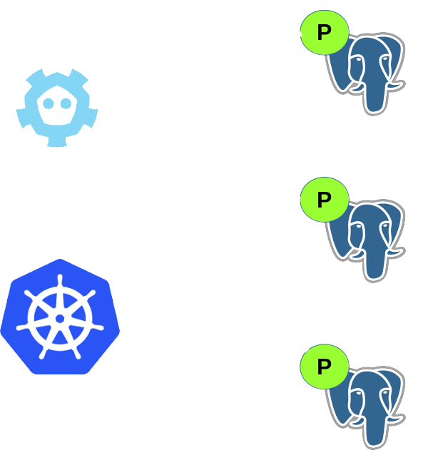

---

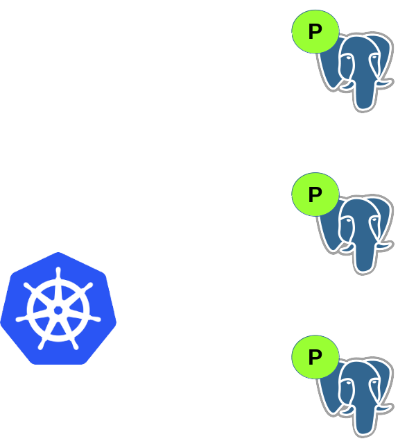

---


---


---

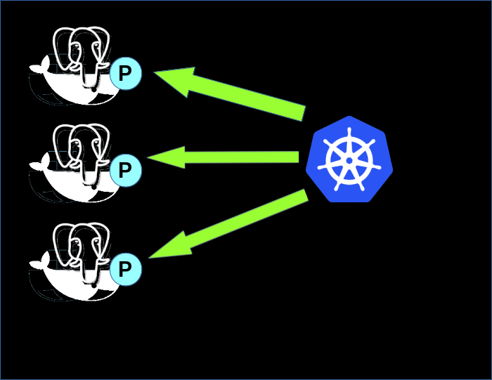

---


---

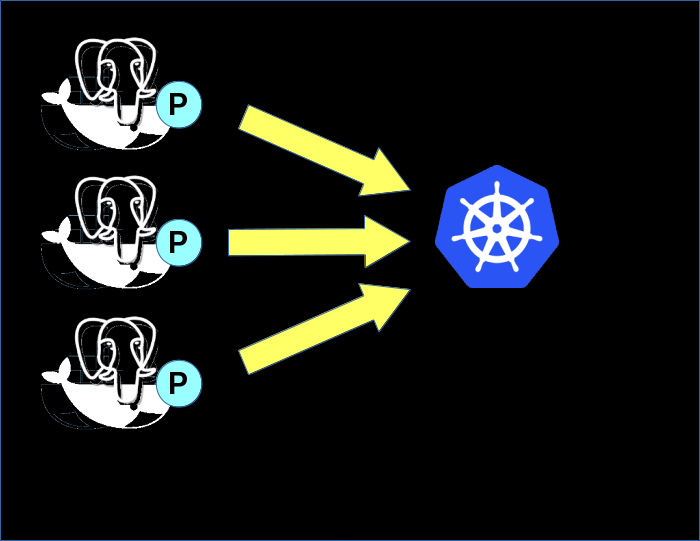

---

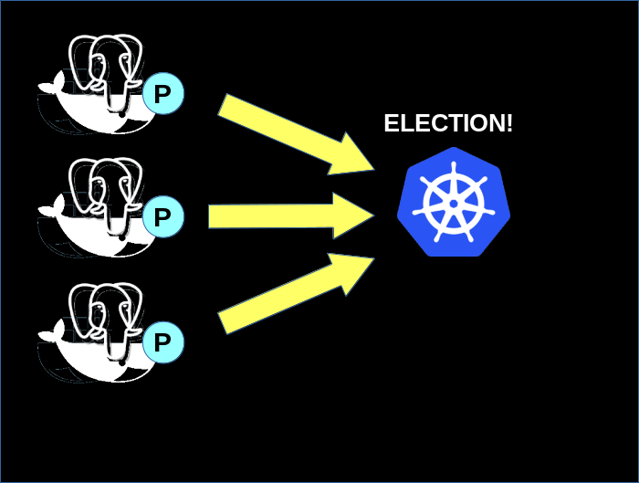

---

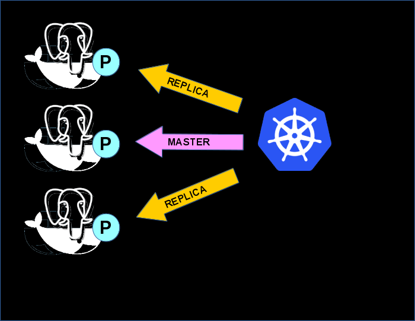

---

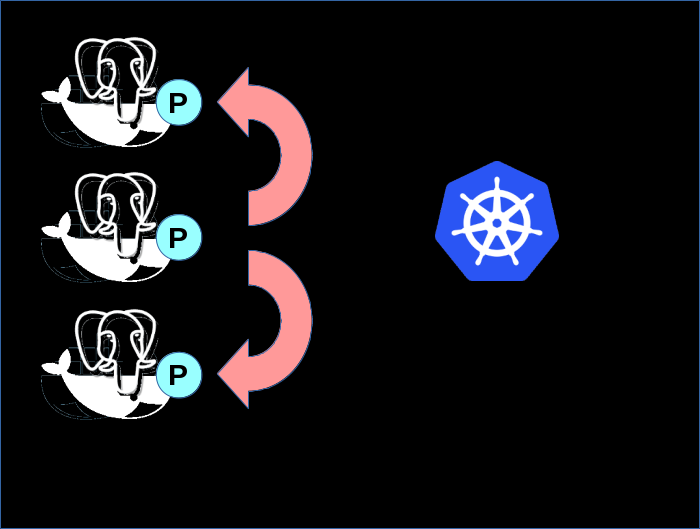

---

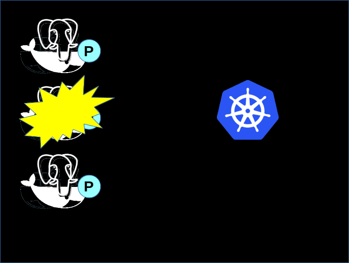

---

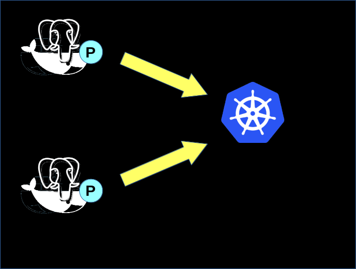

---

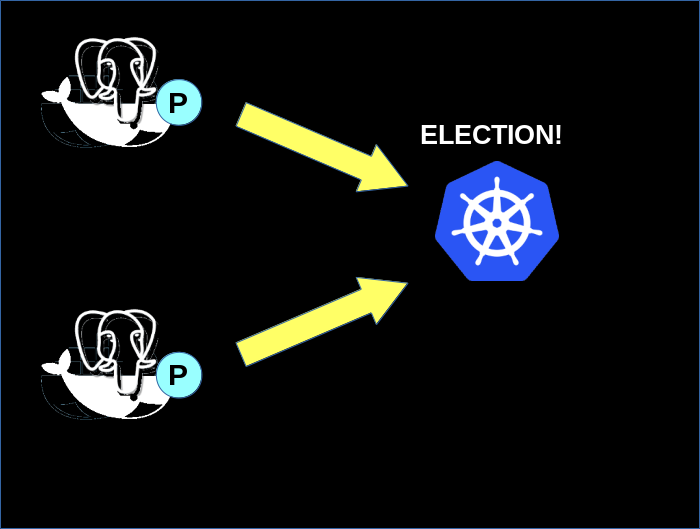

---

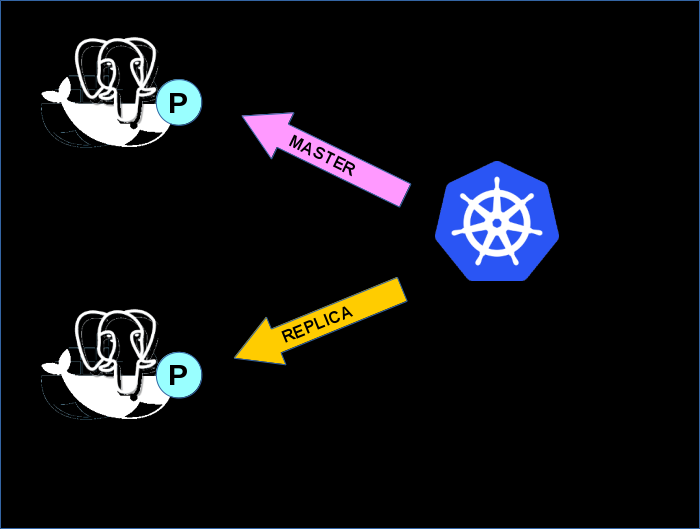

---

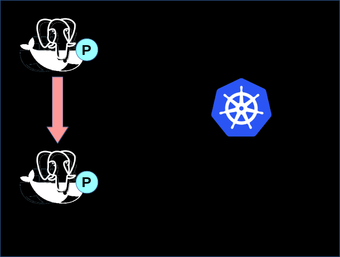

---

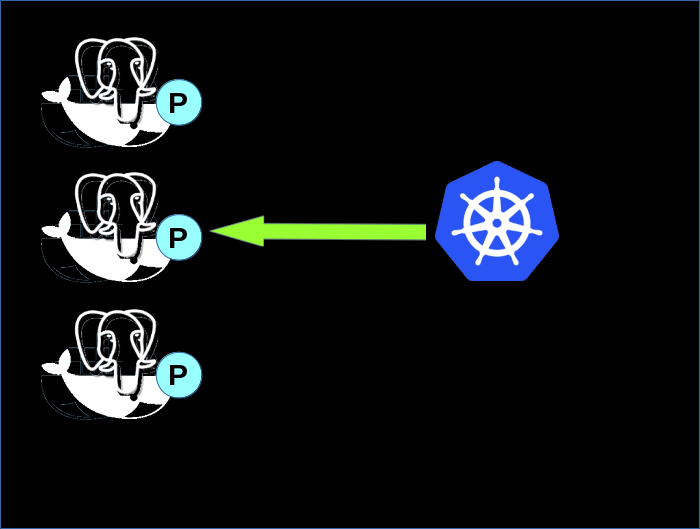

---

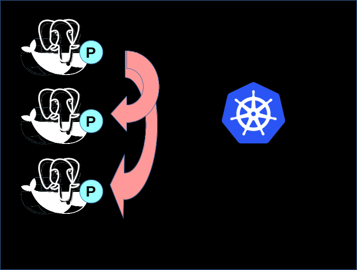

---

## failover

1. Master vanishes
2. Replicas grab lock (Endpoint)
3. Winner checks replication status
4. Update configmap
5. Replicas re-master

---

#### demo

---

#### Operators

---

## Why?

* self-documenting clusters
* all config available via the Kubernetes API
* no kube-yaml required for deployment
* DBs require scheduled work, etc.

---

## why?

if I have to create a manifest anyway, why not
have it run everything?

---

## Spilo Operator

1. Install operator
2. Create manifest for each cluster
3. Modify manifest to modify cluster

---

#### demo

---

## Crunchy Postgres Operator

* command & control operator
* powers Crunchy container suite
* more "enterprise" Postgres install

---

```
pgo create cluster mycluster
pgo scale mycluster \
    --replica-count=3
pgo show cluster mycluster
pgo create backup mycluster
```

---


---

## Operator comparison

| feature | spilo | Crunchy |
|:---------- | ---------- | -------- |
| status | alpha | production |
| control | manifest | command |
| deploy | yes | yes |
| scale | yes | yes |
| docs | no | yes |
| cli | minimal | full |
| openshift | no | yes |
| upgrades | yes | yes |

---

## Planned future work

* merge k8s branch
* integrate operator and k8s branch
* OpenShift-compatiblity
* prometheus integration
* packaging accessories<br />(POWA, pgAdmin, etc.)
* complex replication topologies

---

## Crazy ideas

* Istio integration
* merge operator & patronictl?
* use Metaparticle lock CRD?
* pg 10 logical replication?
* workloads API?

---

## Kubernetes Limitations

* multi-DC clusters<br />
  (needs StatefulSet Federation)
* leader election?
* upgrading StatefulSets
* kubectl extensibility

---

## contributors wanted!

github.com/zalando/patroni

---

#### Let's Make PostgreSQL Boring

---

## other resources

* github.com/zalando-incubator/postgres-operator
* github.com/zalando/spilo/
* github.com/CrunchyData/postgres-operator

---

# ¿questions?

.left-column-narrow[
more<br />jberkus:

Red Hat:

&nbsp;
]

.right-column-wide[
@fuzzychef<br />
www.databasesoup.com<br />
jberkus.github.io

community.redhat.com

&nbsp;
]

.leftlogo[]

.rightlogo[]
