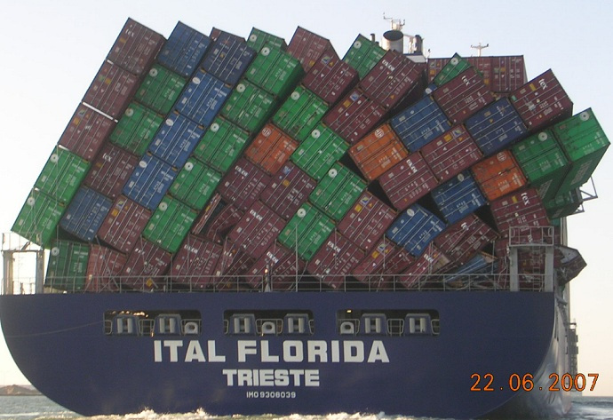
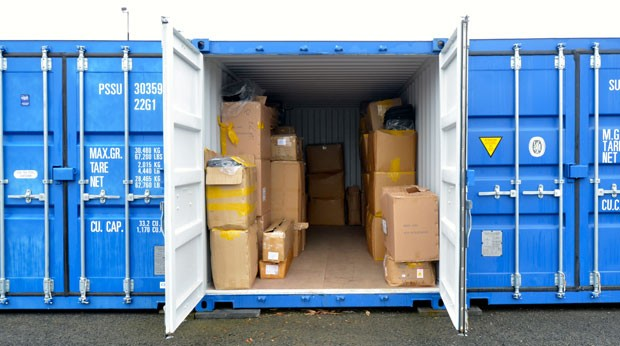
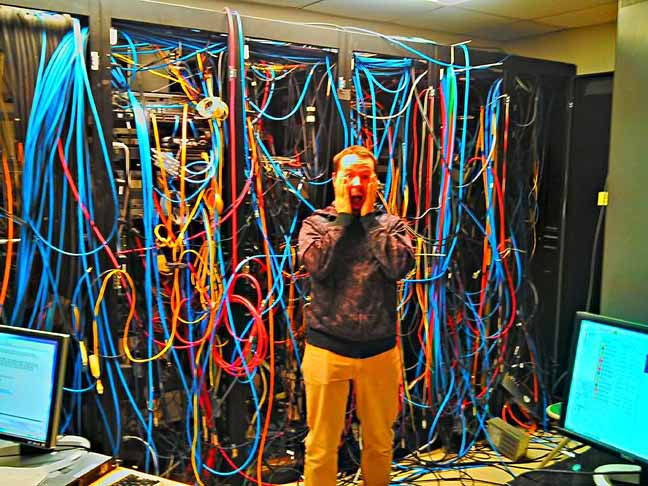

### Kubernetes 1.10 Release


.sigblock[
Josh Berkus

Red Hat OSAS

CNPDX March 2018
]

.leftlogo[]

---


---



### Stability Release

---

## Things that Moved to Beta

* CronJobs
* Node Access ACL
* Pod Security Policy
* CoreDNS
* configure resolve.conf
* PVC Protection
* Mount Namespace Propagation
* Storage Topology
* Local Storage PVs
* CSI

---

## Things that Moved to Stable

* API Aggregation

---

## New Features (Alpha)

* TokenRequest API
* External client credentials
* Dynamic Kubelet Config
* kubectl extensions
* CRD subresources
* Windows, Azure support

---

### Alpha?  Beta?  Stable?

---

## Alpha α

* New features
* Disabled by default behind _feature gate_
* No API stability
* Partial tests

```
kubeadm init --feature-gates=CoreDNS=true
```

---

## Beta β

* Alpha for 1-3 releases
* May be enabled by default
* Mostly API stable
* Full test suite
* Sometimes behind feature gates

---

## Stable Σ

* Beta for 1-3 releases
* Kubernetes feature
* Stable APIs
* Upgradeable

---



### Storage Changes

---

## β: CSI to 0.2.0

Container Storage Interface

_makes storage fully pluggable_

---

## β: PVC Protection

_How It Was_: you could delete a PV or PVC in use by a pod

_Now_:  controller will stop you

on by default in 1.10

---

## β: Local PVs

* create "durable" local volumes
* required storage migration is up to you (or plugins)

---

## α: Topology Aware Vols

Topology Aware Volume Scheduling

* This EBS is only available in zone uswest-c
* This SAN is attached to these 8 Nodes

---



### Network Changes

---

## β: CoreDNS

* replaces kube-dns
* simpler
* more configurable
* NOT default
* can migrate

kubeadm init --feature-gates=CoreDNS=true

---

## α: configure resolve.conf

* instead of default DNS
* multi-tenanting
* advanced service discovery

---


### Auth Changes

---

## α: Advanced Auditing

* in progress since 1.8
* audit all activity in the cluster
* apply policies and rules
* record to databases

---

## α: client credential providers

* kubectl
* client-go

authenticate against 3rd-party providers

_no more forking kubernetes for OAUTH_

---

## α: TokenRequest API

* Yet Another Plugin Interface
* generic way to request JSON Web Tokens (JWT) for authentication
* supports pluggable authentication

---

## β: More ACLs

* Pod Security Policy
* Limit Node Access to the API

---


### Node Changes

---

## α: Dynamic Kubelet Config

_how it was_: you can only change kubelet configuration through command-line flags passed at startup

_now:_: the kubelet uses a config file

* versionable
* manageable
* rollout without restarts

---

## β: Resource Management

* CPU Manager<br />_core reservation_
* Huge Pages<br />_10GB containers_
* Device Plugins<br />_share your GPU with Kube_

---


### Other Features

---

## Σ: API Aggregation

add custom APIs for additional objects:

* service catalog
* operators

... and direct to them via URL

---

## α: kubectl + Extensions

_how it was:_ if you had a custom object (CRD, storage, operator) then auto-complete and some verbs wouldn't work.

_now:_ all custom objects can expose keywords and verbs for easy CLI.

---

## β: CronJobs

* was ScheduledJobs

```
apiVersion: batch/v1beta1
kind: CronJob
metadata:
  name: tiktok
spec:
  schedule: "*/1 * * * *"
  jobTemplate:
    spec:
```

---


### Deprecations

http://www.cartoonsbysheila.com

---

## Etcd2

* no more insecure Etcd
* binary support
* upgrade to Etcd3

---

## Docker 1.10

* _was_ deprecated in 1.9, now broken
* only Docker 1.11+
* or use CRI-O!

---

## insecure API configs

NO MORE:

```
--insecure-bind-address=192.168.1.111
--insecure-port=8080
```

---

## Now, give 1.10 a try!

_as soon as the packages are up, anyway_

---

## ¿questions?


.left-column[
more<br />jberkus:


more<br />kube:
]

.right-column[
www.databasesoup.com<br />
@fuzzychef<br />
jberkus.github.io

kubernetes.io<br />
bit.ly/kube110-rel
]

.leftlogo[]

.rightlogo[]
