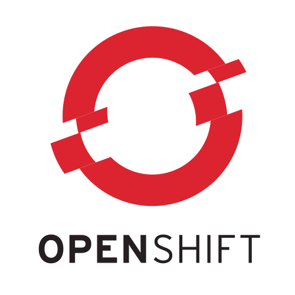

background-image: url(blog_header_k8sbday_dribbble.gif)

.sigblock[
Josh Berkus

Red Hat OSAS

CNPDX July 2016
]

.leftlogo[]

---

## We're One Year Old!


---

## Kubernetes 1.0 -- July 2015

* released at last OSCON in Portland
* stabilized APIs, goals

---

## Kubernetes 1.1 -- November 2015

* Performance improvements
* Rolling updates
* Batch jobs (beta)
* exec

---

## Kubernetes 1.2 -- March 2016

* Bigger scale
* DaemonSet
* ConfigMap
* Ingress

---


---

### Contributions

* over 800 contributors
* over 30,000 commits
* 135 meetups

---

#### dev -> prod

---


### www.projectatomic.io

---



### www.openshift.org

---

### Kubernetes 1.3


---

## 1.3 Big Features

* MiniKube
* PetSet
* Node Autoscaling
* Federation

---

## minikube!

kubernetes on your desktop

* just a vm
* run it easily
* test out kubernetes services

---

## installing minikube

1. install VitualBox (or KVM, xhyve)
2. install kubectl (Linux)
3. download an installation script
4. run the script

---

#### using minikube

---

#### PetSet

---

#### stateless microservices are easy<br /><br />.<br />.

---

#### stateless microservices are easy<br /><br />*stateful services are harder*

---

## stateful service requirements

* stable endpoints for individual containers
* predictable container identity
* stable storage tied to specific containers
* configurable container/node deployment

---

## 1.2: DaemonSet

* one service per node
* abused to support Pets

---

## PetSet: stable endpoints

each pod gets a dns name as well as its service:

```
service:
   postgres.example.com
pods:
   postgres-0.example.com
   postgres-1.example.com
   postgres-2.example.com
```
---

## PetSet: predictable node identity

1. postgres-0
2. postgres-1

---

## PetSet: predictable node identity

1. postgres-0
2. postgres-1
3. postgres-2
4. postgres-3
5. postgres-4

---

## PetSet: predictable node identity

1. postgres-0
2. postgres-1
3. postgres-2
4. postgres-3

---

## PetSet: storage tied to pod

```
volumeMounts:
- name: pgsql-data
  mountPath: /pgdata
```

storage will be named "postgres-0" for pod postgres-0

---

## customized scheduling?

TBD; see "Node Affinity" WIP spec

---

## auto-scaling

1. Horizontal Pod Autoscaling<br />
   *alpha feature since 1.1*
2. Cluster Autoscaling<br />
   *new, requires public cloud*

---

## Horizontal Pod Autoscaling

scale within a cluster of existing nodes

1. set target CPU<br />
   *right now CPU-only*
2. set max and min number of pods
3. scale!

---

```
kubectl autoscale deployment php-apache \
--cpu-percent=50 --min=1 --max=10
```

---

```
kubectl get hpa
NAME         REFERENCE                     TARGET    CURRENT   MINPODS   MAXPODS   AGE
php-apache   Deployment/php-apache/scale   50%       0%        1         20        14s
```

---

## Cluster Autoscaling

1. pods scale until no nodes are available
2. Kubernetes requests more nodes from cloud
3. nodes started
4. new pods deploy to new nodes

requires a supporting public cloud (GCE)

---

#### Federation

---

## federation

* tie together multiple data centers
* adds Cluster object
* adds Federated Service object

---

## Federation Control Plane


---

## Federated Services

1. create a Federated Service
2. automatically creates services on each cluster
3. monitors each cluster
4. creates DNS through plugin
5. auto-routes to healthy clusters

---

## ¿questions?

.left-column[
more<br />jberkus:


more<br />events:
]

.right-column[
www.projectatomic.io<br />
@fuzzychef<br />
jberkus.github.io

DevOpsDaysPDX<br />
Aug 10 MEETUPSROCK

KubeCon<br />
Nov 7, Seattle
]

.leftlogo[]

.rightlogo[]
