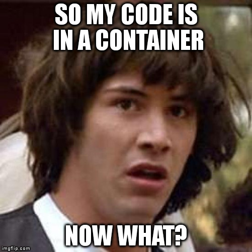
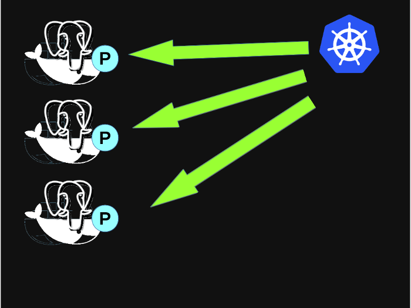

#### Kubernetes 101

.sigblock[
Josh Berkus

Red Hat OSAS

OSBridge 2016
]

.leftlogo[]

---

## Who this is for:

* know what Docker is
* maybe used containers in dev
* don't know much about orchestration

---

---

## Kubernetes: History

1. Google created OSS port of internal code
2. Made it compatible with Docker
3. Donated to CNCF as project
4. Red Hat, CoreOS contributing

---

### Powered by Kubernetes

---

#### microservices

---

#### One Container One Service

---

#### One App Many Containers

---

## Microservice Coordination

* coordinate multiple containers
* "utility" containers (storage etc.)

Bash scripts?  Puppet/Chef/Ansible?

---

### Pods

---

## What's a pod?

* Group of containers
* Deploy together
* Share an IP address, ports
* Share storage

---

#### How do I deploy my containers?

---

## deployment: nodes

* node == machine (hw/vm)
* several nodes in a cluster
* each node runs "kubelet"

---

#### I need to scale out

---

## scaling out: replicas

---

## scaling out: replicas

* scale services with duplicate pods
* kubernetes "scheduler" places them

---

#### How do I access my apps?

---

## sharing: services

* with other pods in the cluster (DB)
* with external networks (web)

---

#### But I need to configure my apps

---

## configuration

* help defining service at runtime
* pass configuration vars to containers

---

## configuration options

* ENV
* ConfigMap
* Secrets (old)

---

#### What about stateful services?

---

## storage: volumes

* Volumes: local storage per node
* PersistentVolumes: shared storage on network storage

---

## how does all this work?

---

## what kube does

* grouping: pods
* deployment: nodes
* scale-out: replicas
* sharing: services
* configuration
* storage: volumes

---

## ¿questions?

.left-column[
more jberkus:

more events:
]

.right-column[
www.projectatomic.io 
@fuzzychef 
jberkus.github.io

KubeCon 
Nov 7, Seattle

Cloud Native PDX Meetup
]

.leftlogo[]

.rightlogo[]
