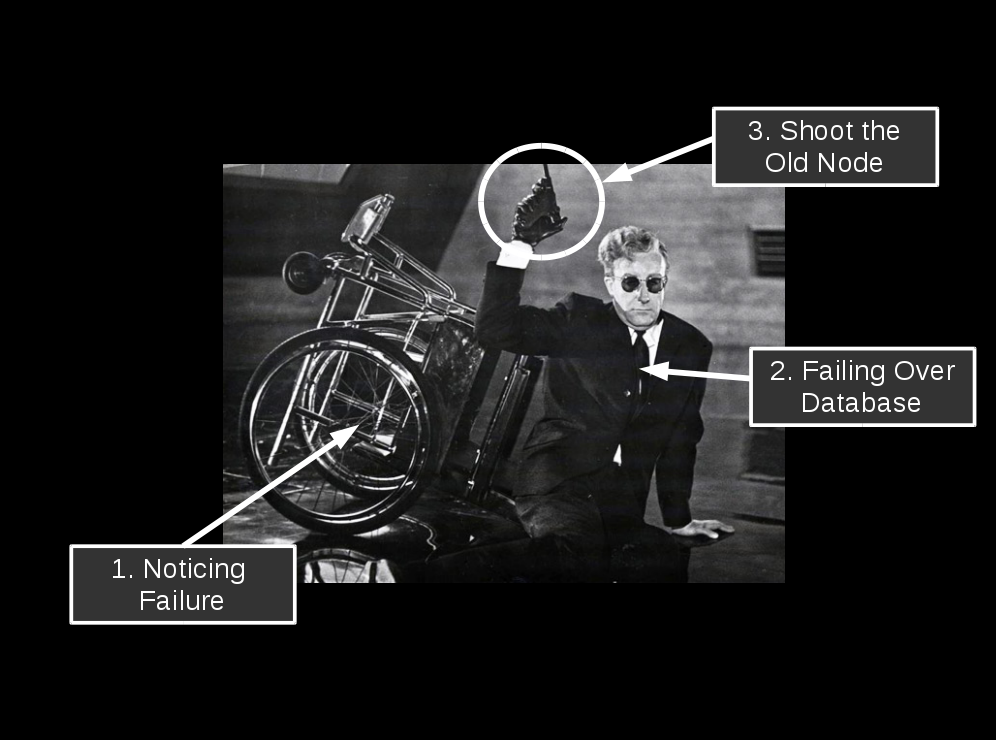
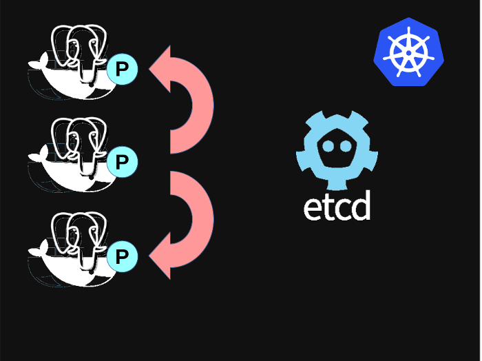
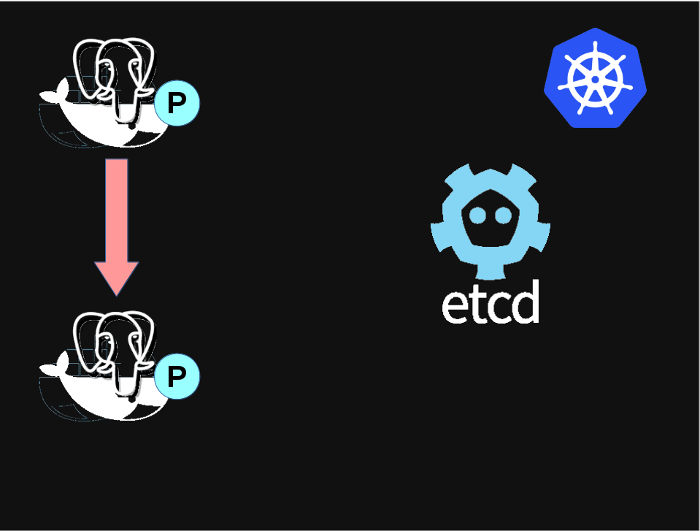
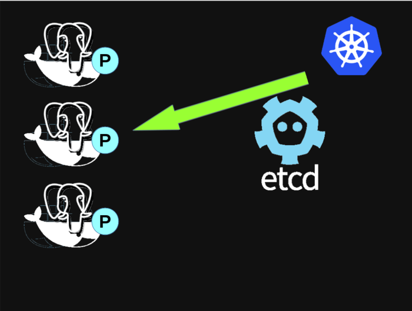
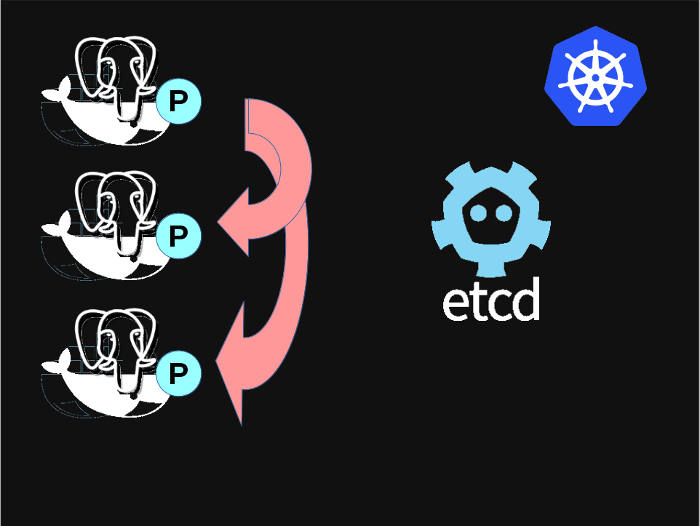
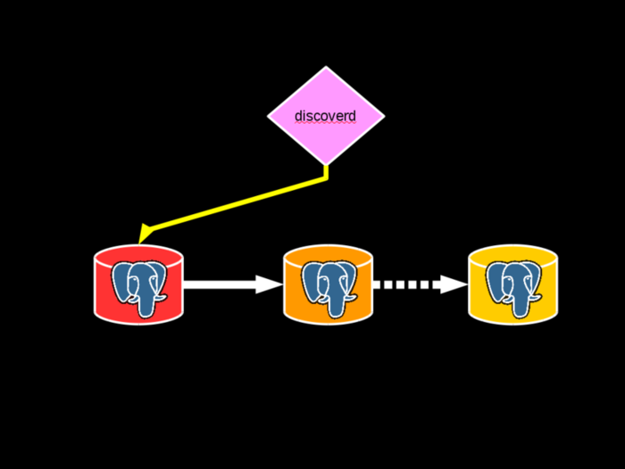
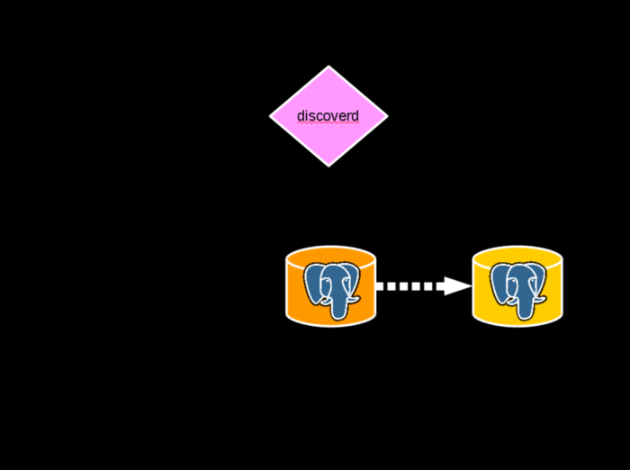
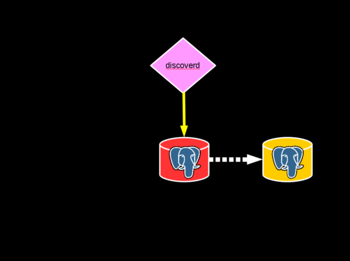
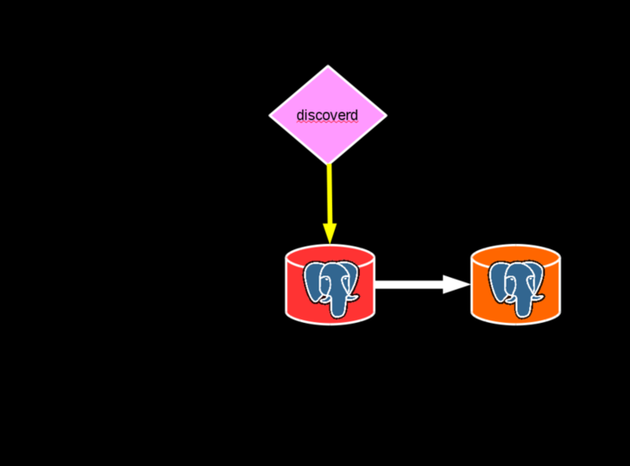

background-image: url(title_slide.png)

.sigblock[
Josh Berkus

Red Hat Project Atomic

pgCon 2016
]

.rightlogo[

]

---
background-image: url(dr_strangelove2.jpg)
background-position: center;
background-repeat: no-repeat;
background-size: contain;

#### Fully Automated High Availability

---

---

---

---

### Demo

---

## Single Master Postgres: Problem

* low availability
* unidirectional replication
* very manual HA solutions

---

## Why not multi-master?

Well, you want to talk hard problems ...

---

## But PG Replicaton is Awesome!

* Easy to set up
* Guaranteed
* Corruption-free
* Anti-footgun
* Combines with DR

---

### Y U No Failover?

---

background-image: url(too_complicated.gif)

#### "Automated failover is too complicated.  You don't want it."

---

#### NO!

---

## Hard != Impossible

---

## Hard != Impossible

_general_ autofailover is prohibitive

but ... we can implement common use cases

---

## The 80% Solution

1. Pool of async replicas
2. Cheap/replacable nodes
    Containers
3. Watchdog service
4. Auto-promote one replica
5. Other nodes remaster
6. Update routing

---

## Now, a little history ...

---

## Handyrep

* master-controller architecture
* based on Python Fabric + SSH
* worked in production
* worked with any Postgres config
* pluggable

www.handyrep.org

---

---

## Handyrep: _too general_

* Difficult to install
* Difficult to debug
* Over 100 configuration options
* Scaled poorly
* HR server was SPoF

---

---

## The Problem with Master-Controllers

* Failover Code: 100 lines, 1 issue
* Detecting Desynchronization: 400 lines, 10+ issues

_Need to make sure that if the controller shuts down, so does PostgreSQL_

---

## Zalando

* no1 European online fashion
* 15m customers
* 150 databases
* 24/7/365 operation

... needed automated, decentralized HA

---

## Failover Failure

.left-column[

]

.right-column[

* False failover
* Misfires
* Race conditions

]

---

---

## Split Brain and 1-M DBs

* worst possible outcome
* automated recovery impossible
* manual recovery painful

---

## Patroni

---

---

1. Postgres is a poor store of its own replication state
2. Smart agents > top-down controllers

---

## Compose Governor

* Containers
* Etcd-based consensus
* Simple PostgreSQL controller

... so we forked it.

---

# How it works

---

---

---

---

## The Patroni Controller

---

## Patroni controller

* Python daemon
* Runs in each container as PID 1
* Controls Postgres startup/shutdown/config
* Provides external REST API
* Enforces opinionated config

---

## Patroni Failover

 leader

---

## Patroni Failover

---

## Patroni Failover

---

## Patroni Failover

---

## Patroni Failover

---

## Patroni Failover

---

## Patroni Failover

---

## Patroni Failover

---

## Patroni Failover

---

## Patroni Failover

---

## Patroni Failover

---

## Patroni Failover

---

## Patroni Failover

---

## Patroni Failover

---

## Patroni Failover

---

### What about split-brain?

---

## Etcd

* distributed consensus HTTP data store
* Raft algoritm
* implements CA
* great for config + metadata
    * not for data data

---

## Etcd Alternatives

* Zookeeper
    * larger scale
* Consul
    * geo-dist, gossip
    * not (yet) suppported
* pg_paxos?

---

## Stacks: Spilo

_Production Stack_

* From Zalando
* Patroni
* AWS Tools
* AWS Automation

---

## Stacks: AtomicDB

_AtomicDB demo project_

* PostgreSQL
* Patroni
* Atomic Host
* Kubernetes
* Dynamic proxy (dev)
* Cockpit UI (dev)

---

### Let's see that again

---

## Alternatives

---

## Flynn.io

* Descendant of Manatee, Yoke
* Production code
* No-data-loss solution
* Depends on ZFS
* https://github.com/flynn/flynn

---

---

---

---

---

## Flynn vs. Patroni

* Flynn: Max Data Protection (CP), Go
* Patroni: Max Availability (PA), Python

Use Flynn to guarantee keeping your data, use Patroni to guarantee that a DB is available and can scale.

---

## Other Alternatives?

* Stolon: Patroni in Go
* Original Compose.io
* Manatee
* Nanopack/Yoke

---

## The Proxy Problem

* differentiate master and read-only connections
* master service needs to follow failover
* can't manage persistent endpoints in Kubernetes 1.2

---

## pgbouncer?

* current implementation in pgbouncer
* master, read slaves separate services/ports
* depends on flannel LB
* problems: no live failover (can't terminate active connections)

---

## proxy possibilities

* augment pgbouncer
* Flynn discoverd code, or Solon proxy
* new Go-based proxy
* Kubernetes 1.3 PetSet

---

## More features

* pg_rewind support (9.4+)
* configurable node imaging
    * WAL-E
    * PITR
* synchronous replication
* non-failover replicas

---

## More Stuff Under development

* cascading replication
* Consul support
* BDR support?

_fork us on Github!_

---

## Resources

* This Presentation:
   jberkus.github.io/love_failover
* Patroni Project:
   github.com/zalando/patroni
* AtomicDB Demo:
   github.com/jberkus/atomicdb

---

## ¿questions?

.left-column-narrow[
more jberkus:

project atomic:

&nbsp;
]

.right-column-wide[
@fuzzychef 
www.databasesoup.com 

www.projectatomic.io
_See micro-cluster at RH Summit, Dockercon_
&nbsp;
]

.leftlogo[]

.rightlogo[]

---

#### Come to pgConf Silicon Valley! www.pgconfsv.com November 14-16
