.left-column[

]

.right-column[

##### Patroni: Your Patron Saint of PostgreSQL HA

]

.sigblock[
Josh Berkus

Red Hat OSAS

SCALE 2016
]

.leftlogo[]

---

#### Demo

---

## PG Replicaton is Awesome!

* Easy to set up
* Guaranteed
* Corruption-free
* Anti-footgun
* Combines with DR

---

### Y U No Failover?

---

#### "Automated failover is too complicated.  You don't want it."

---

#### NO!

---

## Hard != Impossible

_general_ autofailover is prohibitive

but ... we can implement common use cases

---

## The 80% Solution

1. Pool of async replicas
2. Cheap/replacable nodes
    VMs/Containers
3. Watchdog service
4. Auto-promote one replica
5. Other nodes remaster
6. Update routing

---

## Now, a little history ...

---

## Handyrep

* master-controller architecture
* based on Python Fabric + SSH
* worked in production
* worked with any Postgres config
* pluggable

www.handyrep.org

---

## Handyrep: _too general_

* Difficult to install
* Difficult to debug
* Over 100 configuration options
* Scaled poorly
* HR server was SPoF

---

## Zalando

* no1 European online fashion
* 15m customers
* 150 databases
* 24/7/365 operation

... needed automated, decentralized HA

---

## Failover Failure

.left-column[

]

.right-column[

* False failover
* Misfires
* Race conditions

]

---

---

---

---

## Compose Governor

* Containers
* Etcd-based consensus
* Simple PostgreSQL controller

... so we forked it.

---

# How it works

---

### failover est omnis divisa in partes tres

---

### failover est omnis divisa in partes tres

---

## How it works

 leader

---

## How it works

---

## How it works

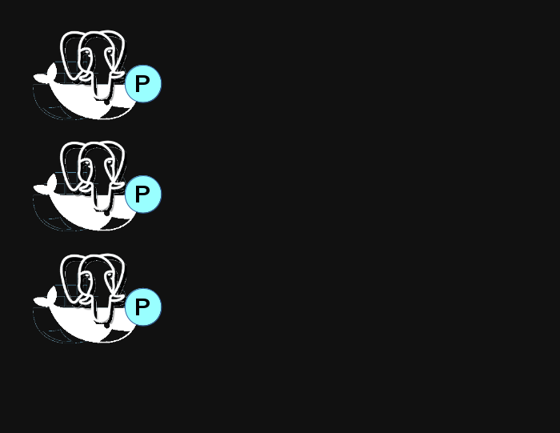

---

## How it works

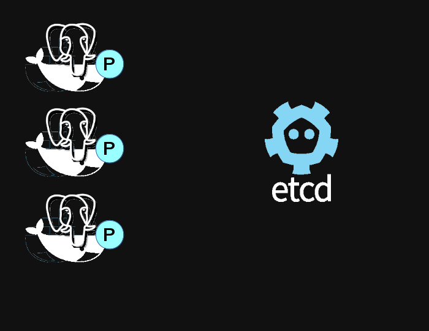

---

## How it works

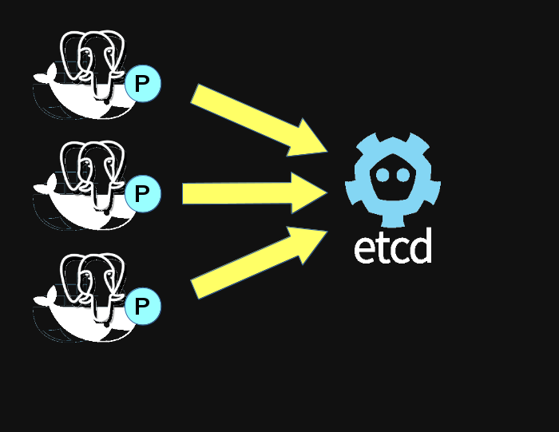

---

## How it works

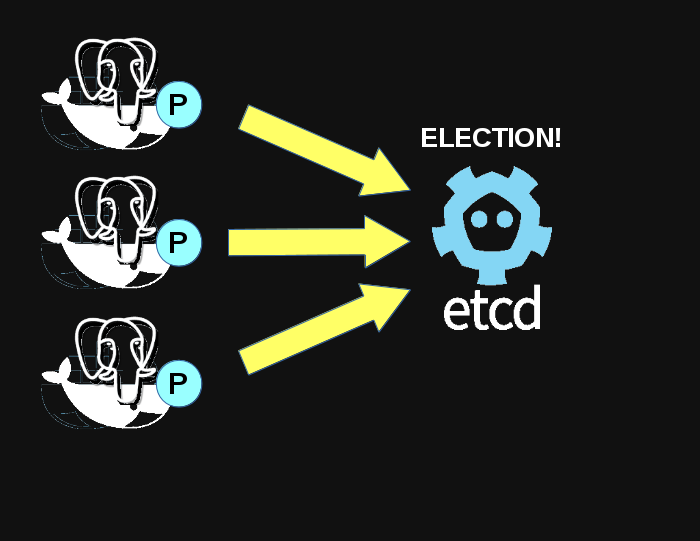

---

## How it works

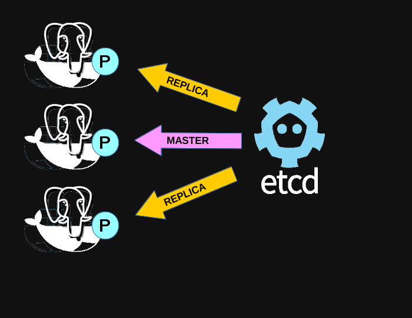

---

## How it works

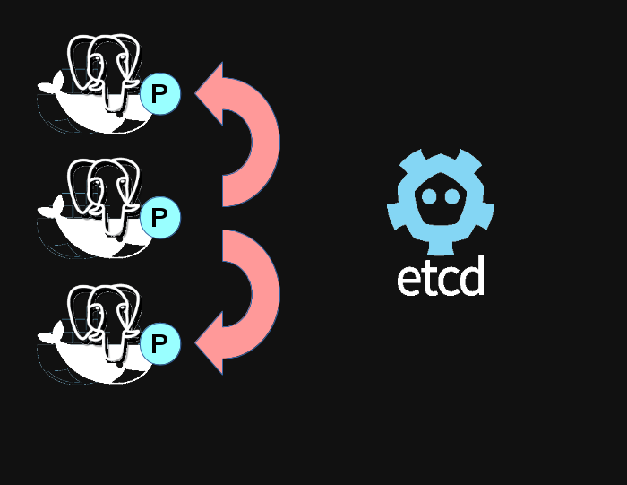

---

## How it works

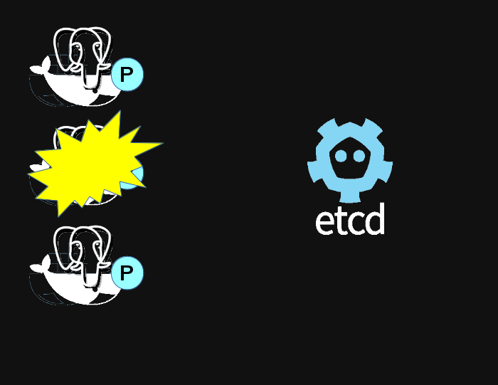

---

## How it works

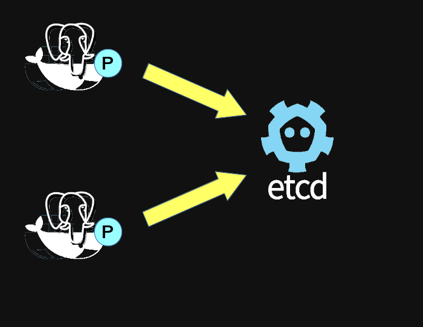

---

## How it works

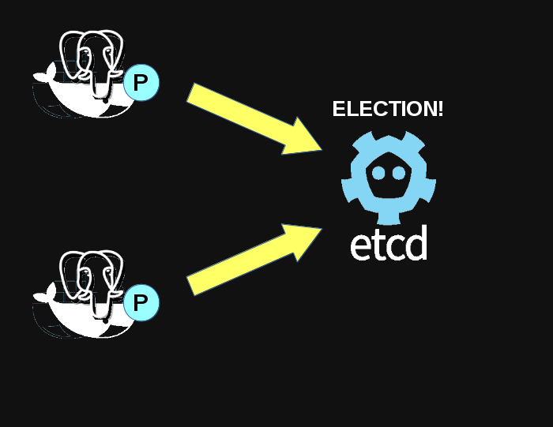

---

## How it works

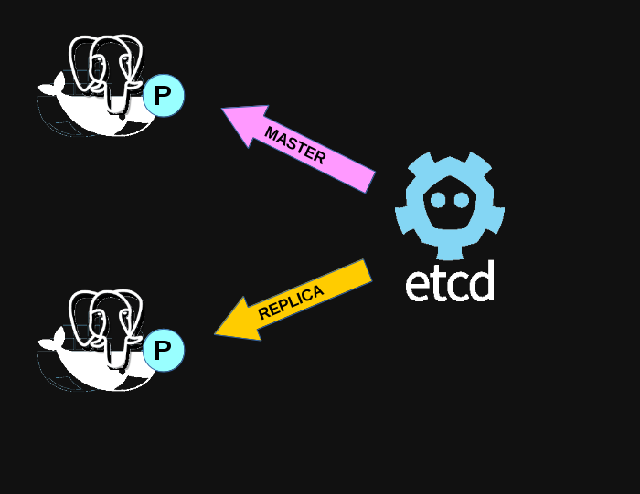

---

## How it works

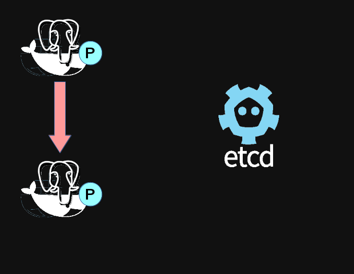

---

### What about split-brain?

---

## Etcd

* distributed consensus HTTP data store
* Raft algoritm
* implements CA
* great for config + metadata
    * not for data data

---

## Etcd Alternatives

* Zookeeper
    * larger scale
    * supported
* Consul
    * integrates discovery
    * not yet suppported

---

### Distributed consensus

---

### Net-split prevention

---

#### Let's see that again

---

## What's included

* Patroni agent
* RESTful API
* patroni-cli

---

## What's not included

* Proxy/routing
* GUI
* Orchestration
* Monitoring

---

## Downstream projects

* Spilo
    * From Zalando
    * AWS tools + Patroni
    * https://github.com/zalando/spilo

---

## Downstream projects

* AtomicDB
    * Patroni + Kubernetes + Atomic
    * OpenShift-compatable
    * not public yet

---

## More features

* pg_rewind support (9.4+)
* configurable node imaging
    * WAL-E
    * PITR
* synchronous replication
* non-failover replicas

---

## Under development

* cascading replication
* integrated proxy
* BDR support?

_fork us on Github!_

---

## Resources

* This Presentation:
   jberkus.github.io/patron_saint_of_ha
* Patroni Project:
   github.com/zalando/patroni
* Spilo Project:
   github.com/zalando/spilo
* Compose governor:
   github.com/compose/governor

---

# ¿questions?

.left-column-narrow[
more jberkus:

project atomic:

&nbsp;
]

.right-column-wide[
@fuzzychef 
www.databasesoup.com 
jberkus.github.io

www.projectatomic.io

&nbsp;
]

.leftlogo[]

.rightlogo[]

