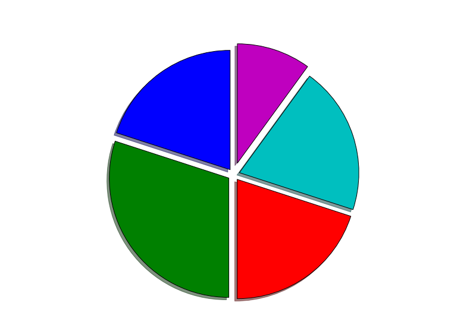
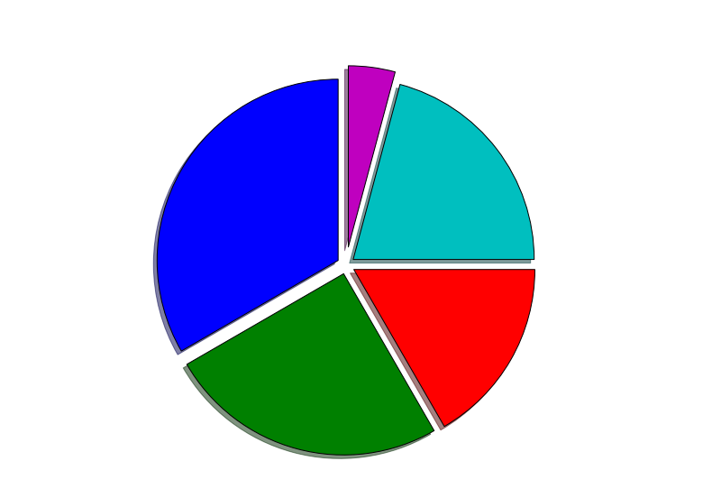
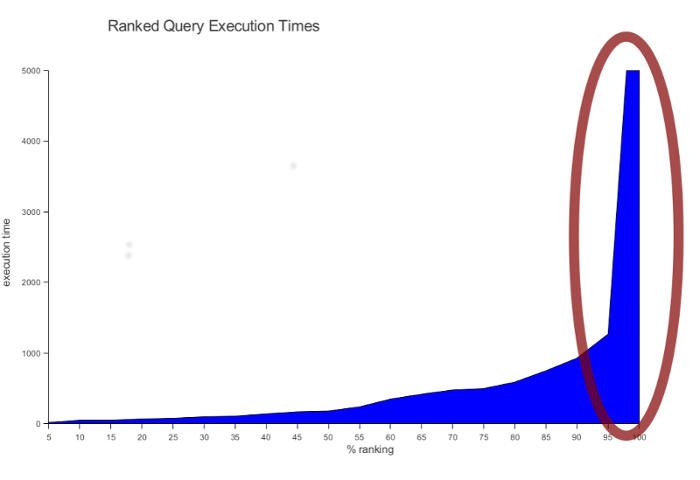
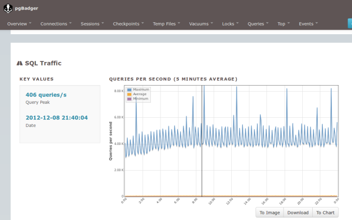
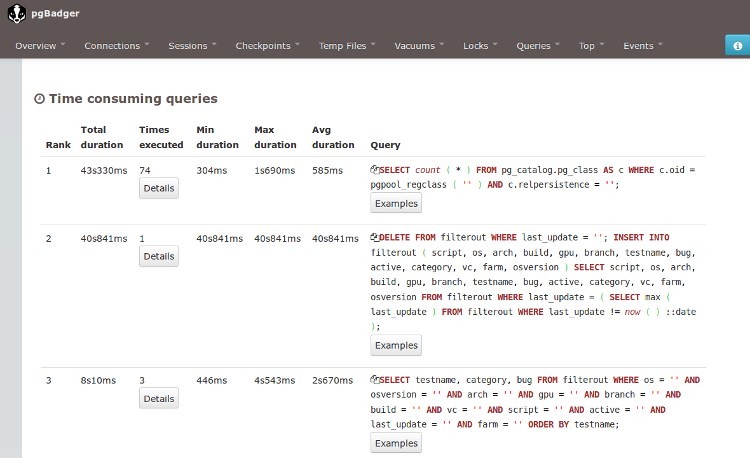
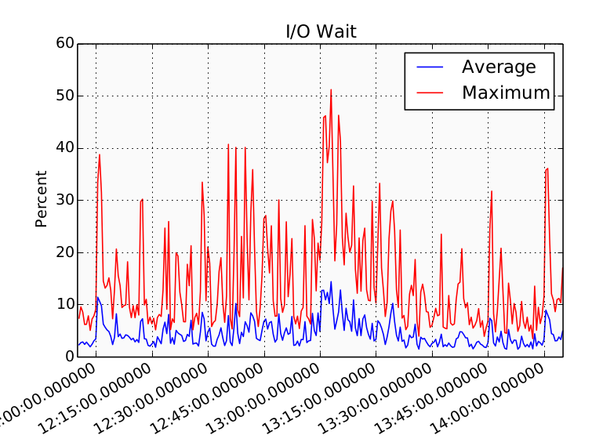
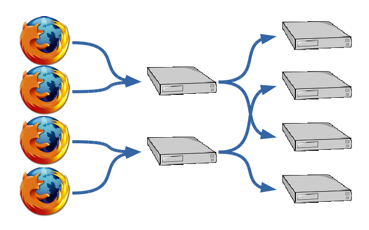
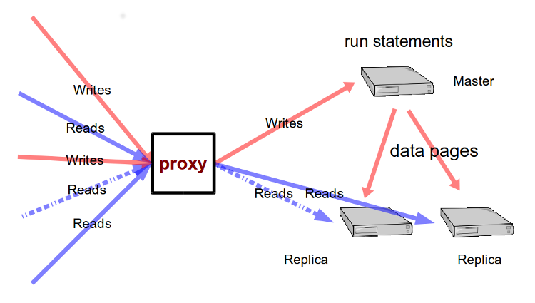

background-image: url(runningelephant.jpg)

class: center, top

#### Postgres Performance<br />in 15 Minutes

.sigblock[
Josh Berkus

PostgreSQL Experts

DjangoCon US 2015
]

.leftlogo[]

---

# go_faster = 10

---

.middle[]

---

.middle[]

---

# Do Less

---

# do I need the database to answer that?

---

## caching

* results cache
* redis
* memcached
* CDN

---

# some data access anti-patterns

---

## polling

```python
while True:
    j = check_for_job(pid)
    if j is None:
        continue
```
            
---

## data you already have

```python
curUser = Users.object.filter(pk=sessionUser).values()
curUserID = curUser[0]["id"]
```
---

## data you already have

```sql
SELECT id FROM users 
WHERE id = ?
```
---

## data you don't need

```python
AllProfiles = Profile.objects.all().order_by('-updated')
LastProfile = AllProfiles[0]
```
    
---
    
## join loops

```python
for Player in Roster:
    myGames =
      Games.object.filter(player_id=Player["id"]).values();
```

```sql
SELECT * FROM games WHERE player_id = ?
-- repeat 200X
```

---


## resource-hungry queries

---



### query hockey stick
        
---



### pgBadger

---



### pgBadger

---

## improving slow queries

* add indexes
* fix filter expressions
* analyze/autoanalyze

---

## text searching

**startswith**: requires varchar_pattern_ops

**istartswith**: requires function index or CItext

**icontains**: use TSearch or trigrams

---

## transaction pitfalls

**bad**: bundling reads into a transaction

**worse**: holding a transaction open while rendering

**worst**: holding a transaction open while waiting for user input

---

## locking

check for "waiting" queries:

```sql
SELECT * FROM pg_stat_activity WHERE waiting;
```
does your program logic have multiple threads update
the same data at the same time?

---

# adequate hardware

.center[*and virtual hardware*]

---

.center[]

## You can't outperform inadequate hardware

---

## IO is more important than you think



---

## postgres writes all the time

* COMMITs
* replication
* "hint bits"
* statistics

IOPS + throughput == performance

---

## optimizing IO

**own HW**: use SSDs, HW RAID

**cloud**: get more IOPS, EBS-optimized

**also**: No More EXT3! (or HFS or NTFS)

**and**: some Linux Kernel issues (3.2, 3.5)

---

## RAM usage is thresholded

**good**: enough to cache "working set"

**better**: cache the whole database

**best**: DB fits in shared_buffers

---

## some AWS tips

* use GP2 + extra GB
* PAAS != performance
* check zone distance

---

## scaling infrastructure



---

## the easy stuff

use the latest version of PostgreSQL<br />
*perf improvements in every release*

put PostgreSQL on its own server/instance<br />
*databases do not share well*

---

## use pgbouncer for connection pooling

```bash
pool_mode = transaction
```
---


### event-based pooling

---



### load balance to read slaves

---

## load balancing using routes

```json
DATABASES = {
'master': {
    'NAME': 'master',
    'ENGINE': 'django.db.backends.pgsql'
},
'replica1': {
    'NAME': 'replica1',
    'ENGINE': 'django.db.backends.pgsql'
} ...
```

---

## load balancing special workloads

* reporting
* cache refresh
* queueing (separate DB)

---

# postgresql.conf

---

## memory use

```bash
shared_buffers = 2GB
# RAM/4 up to 8GB

work_mem = 32MB
# 8MB to 32MB: web
# 128MB to 1GB: reporting
# limit: RAM/(max_connections/2)
```

---

## more memory use

```bash
effective_cache_size = 6GB
# 3/4 of RAM

wal_buffers = 64MB
# just set it

maintainence_work_mem = 512MB
# RAM/32
# more for reporting
```

---

## WAL

```bash
checkpoint_segments = 64
# make WAL bigger
# space / 32MB

checkpoint_completion_target = 0.9
```

---

## more settings

```bash
stats_temp_directory = '/mnt/ramdisk'
# helps with latency

random_page_cost = 1.5
# for AWS, SSD

effective_io_concurrency = 4
# for AWS, SSD, RAID
```
    
---

## logging settings

```bash
log_connections = on
log_disconnections = on
log_temp_files = 1kB
log_lock_waits = on
log_checkpoints = on
log_min_duration_statement = 0
```
---

## recap

* Do Less querying
* fix resource-hungry requests
* get adequate hardware
* scale your infrastructure
* tune the config a little

---

# questions?

.left-column[
more<br />jberkus:


more<br />events:
]

.right-column[
www.pgexperts.com<br />
www.databasesoup.com

austinPUG Thursday night:<br />
www.meetup.com/austinpug

Postgres Open:<br />
Sept 16-18, Dallas

pgConfSV:<br/>
Nov. 18, San Francisco
]

.leftlogo[]
