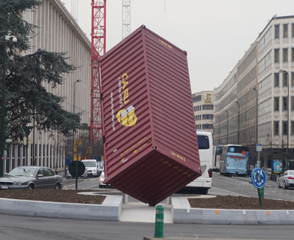
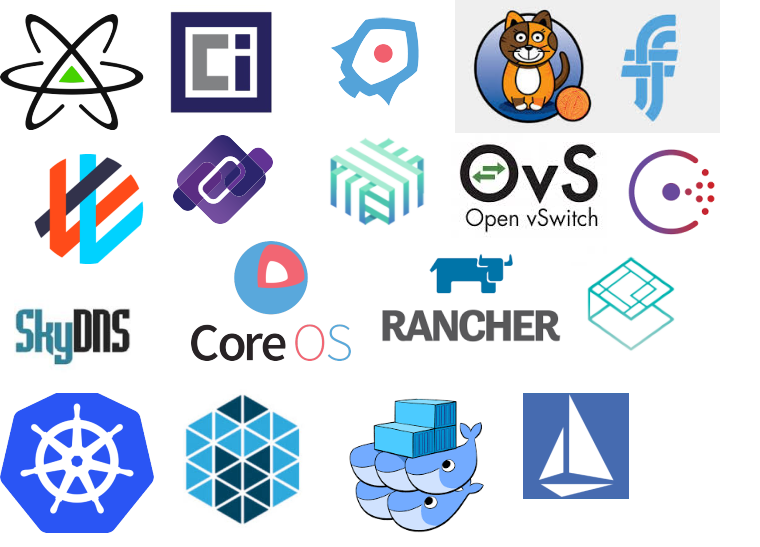
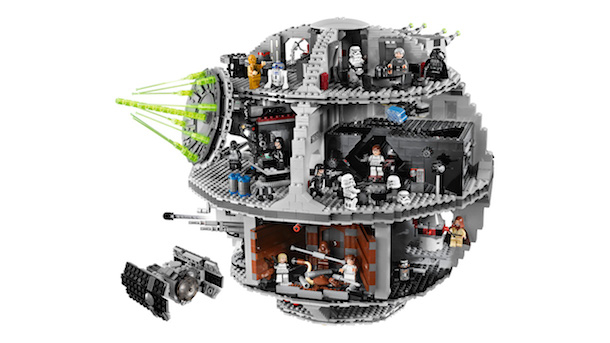
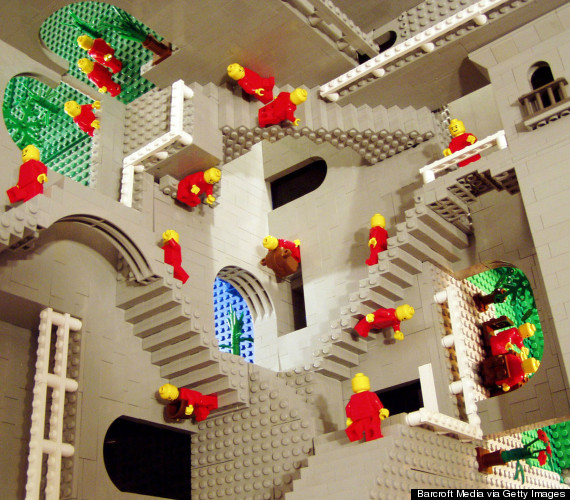
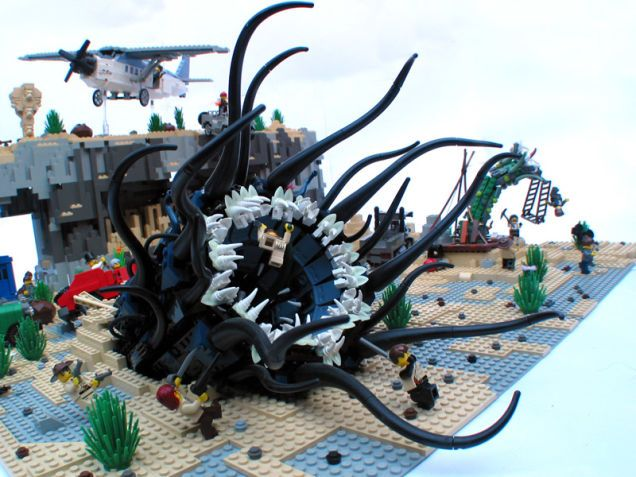
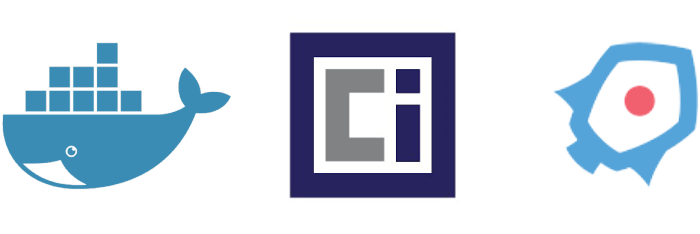
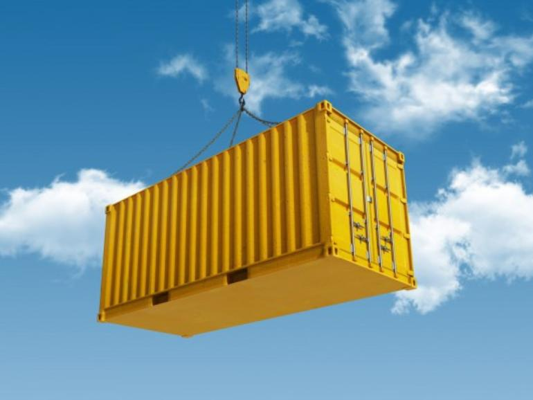
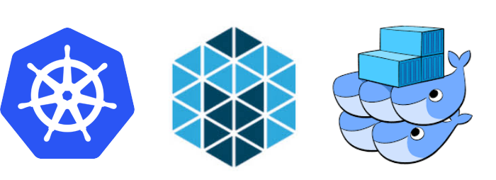
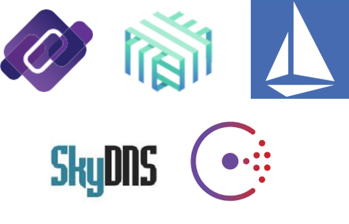

background-image: url(faces_shipping_containers.jpg)

##### Containers: A Guide for the Perplexed

.sigblock[
Josh Berkus

Red Hat

OSB 2017
]

.leftlogo[]

---

---

---

>"Your purpose should be always to know the whole that was intended to be known."

---

>"A sensible man should not demand of me, or hope that when we mention a subject, we shall make a complete exposition of it."

---

---

### What's a container?

---

---

---

#### Everything You Know About Containers Is Wrong

---

.left-column[

]

.right-column[
## There Are No Containers
]

---

.left-column[

]

.right-column[
## &nbsp; Interlocking parts
 
 
 
* Linux Namespaces
* Cgroups
* Networking tricks
]

---

---

---

---

background-image: url(container_reflection.jpg)

##### Containers and Images

---

### What's an Image?

---

## Images

1. a tarball 
   containing a user FS
2. some metadata

image == packaging

---

## Layered Images

* union file system: 
  overlayFS, AuFS, devicemapper
* layers can be added
* layers can be shared

---

### Image Formats

---

## Building Images

1. Copy a base image ("Fedora 26")
2. Add new layer(s)
3. Add metadata
4. Bundle up

---

## Building Tools

* Docker Build (Dockerfile)
* rkt
* Buildah
* ad-hoc

---

## Sharing Images: Registries

* hub.docker.io
* Google container registry
* CoreOS quay.io
* Specialty: CentOS, Fedora, etc.
* local registry

---

## Installing images

1. find on registies
2. download to a local cache
3. copy to memory at runtime

docker pull, skopeo

---

## How to Run an Image

*start a single binary from the image running on the host OS in a namespaced process, file, and resource space*

---

## Image Runtimes

* Docker Daemon 
  containerd
* Rkt + Systemd
* OCI + Systemd
* CRI-O

---

background-image: url(many_containers.jpg)

##### From One To Many

---

---

## Container Host OS

1. smaller 
  container support, nothing else
2. immutable 
  updates like containers

---

### Container Host OSes

---

#### "Orchestration"

*run many containers over many machines*

---

## Parts of Orchestration

1. **Scheduler**: dispatches containers to machines
2. **Agents**: manages containers on each machine
3. **API Server**: communicates between machines
4. **DCS**: shared data store for cluster
5. **Plugins**: storage, networking, etc.

---

### Orchestration Systems

---

## Networking

*out of the box, containers have only the host network, so we need to fake a network using Linux kernel tools so that they can pretend to be servers*

---

### Container Networking Tools

---

## Discovery

finding your containers

* name
* service type
* port

some DNS, some not

---

### Discovery Tools

---

## Storage

1. some containers need to store data
2. data can be ephemeral (local Volumes)
3. data can also be long-term (Persistent Volumes)
4. sometimes data needs to move with the container

---

## Ways to do storage

* network storage (NAS)
* local storage w/copying
* cloud storage (Gluster, Ceph, Rook, EBS)

no "container storage" ... yet

---

background-image: url(container_heap.jpg)

##### Other Stuff

---

## Hosting: CaaS and PaaS

* CaaS: someone lets you run containers on their infra (GKE, Amazon CS)
* PaaS: someone lets you run applications as containers on their infra (OpenShift, DEIS)

---

## More Containery Stuff

* monitoring
* tracing
* CI/CD tools
* API tools

---

---

## Still Perplexed?

.left-column[
web:

IRC:

events:
]

.right-column[
www.databasesoup.com
www.projectatomic.io

\#atomic

www.ContainerDaysPDX.org 
August 3, Portland

Cloud Native Portland 
meetup.com/Cloud-Native-PDX/

]

.leftlogo[]

.rightlogo[]
