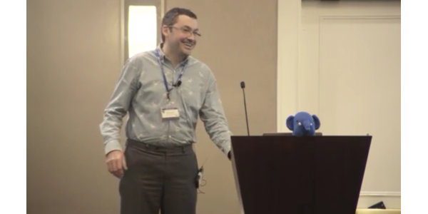
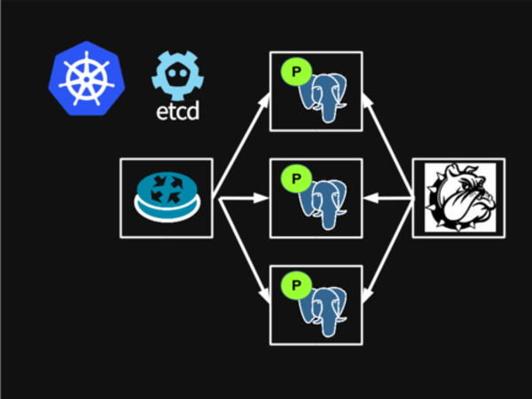
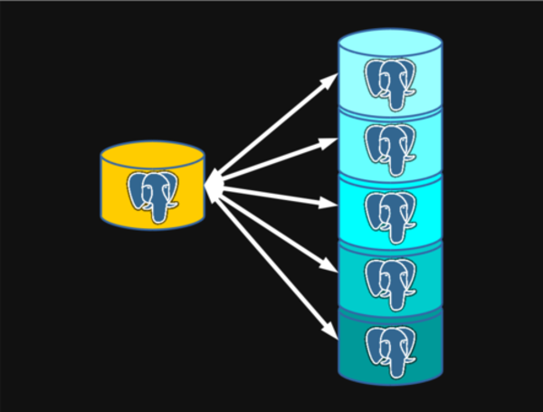
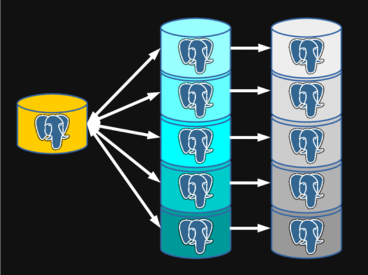

.left-column[


]

.right-column[

##### PetSet<br />and<br />Postgres

]

.sigblock[
Josh Berkus

Red Hat OSAS

KubeCon 2016
]

.leftlogo[]

---



### Thanks, Zalando!

---

#### PetSet

---

#### <strike>PetSet</strike>

---

#### StatefulSet

---


### Automating Postgres

---


### Patroni

---

## What's Patroni?

A daemon which automates PostgreSQL replication
and failover,
running as PID 1 in each container.

---

## Where's Master?


* replicas need to know
* applications need to know

---

## Postgres Problems

* node identity
* replication connections
* master connection
* storage persistence
* shard identity

---

## Node Identity


* monitoring
* special replicas

---


### Replication Identity

---

#### 10.40.0.3

### Replication Identity

---

## IP Address Woes

* pods can move
* IP reuse
* no continuity
* special replicas
* master connections

---

## Replication Slot Woes

```
slot_name | active | Kb_lag
----------+--------+-------------
10.40.0.1 | t      | 11
10.40.0.2 | t      | 9
```

---

## Replication Slot Woes

```
slot_name | active | Kb_lag
----------+--------+-------------
10.40.0.1 | t      | 20210
10.40.0.2 | t      | 4
10.40.0.3 | t      | 3
```

---


## Replication Slot Woes

```
slot_name | active | Kb_lag
----------+--------+-------------
10.40.0.1 | t      | 1420021
10.40.0.2 | t      | 5
10.40.0.3 | t      | 472203
10.40.0.4 | t      | 301766
10.40.0.5 | t      | 201192
10.40.0.6 | t      | 8725
10.40.0.7 | t      | 3
```

---

## Replication Slot Woes

```
FATAL:  could not receive data
from WAL stream:
FATAL:  requested WAL segment
000000060000047C0000001F
has already been removed
```

---

## Workarounds

* failovers (lost nodes, data)
* custom proxies (lag)
* custom discovery (duplication)
* headless services (lost connections)
* cleanup processes (overhead)

---



### Without Statefulset

---

## Storage Issues

* can't reclaim storage
* exclusive access to PVs

---

## Storage Workarounds

* DaemonSet Abuse
* in-app volume management

---



### Sharding

---

#### StatefulSet Solutions

---


---

## Components

1. Etcd cluster
2. Headless service
3. StatefulSet of Replicas
   <br />running patroni
4. Master-only service
5. PVC for PetSet (optional)

---

## PV or Not PV?

* Big Database: PV
* Small Database: EmptyDir()

Big == takes too long to copy

---

## Flaws

* persistent database connections
* connection speed

---

## WIP Postgres Work

* Sharded Postgres (CitusData)
  <br />next week
* MM Replication (alpha)
  <br />next week
* Complex replication topologies

---

#### Still WIP<br />Kubernetes Work

---

## Affinity/Anti-Affinity (1.5)

* no two databases
* no two replicas
* hard vs. soft rules

---

## StatefulSet Federation (1.6?)

* groups of replicas
* different datacenters

---

## IO reservation (???)

* IOPS?
* Throughput?

---

## Reclaim Policies (???)

* scaling down should discard PV
* don't want to reuse corrupt data
* might not want old data
* would be nice to use HostPath

---

## Shadow Shards



---

## Shadow Shards

* assignment
* replacement
* anti-affinity

---

## Resources

* This Presentation:
  <br />jberkus.github.io/petset_postgres
* Patroni Project:
  <br />github.com/zalando/patroni
* Spilo Project:
  <br />github.com/zalando/spilo

---

## More Resources

* Simplified Configuration Scripts:
  <br />github.com/jberkus/atomicdb/
* Helm Chart:
  <br />github.com/kubernetes
  <br />/charts/incubator/patroni

---

# ¿questions?

.left-column-narrow[
more<br />jberkus:

project atomic:

&nbsp;
]

.right-column-wide[
@fuzzychef<br />
www.databasesoup.com<br />
jberkus.github.io

www.projectatomic.io

&nbsp;
]

More at pgconfSV Next Week!

.leftlogo[]

.rightlogo[]
