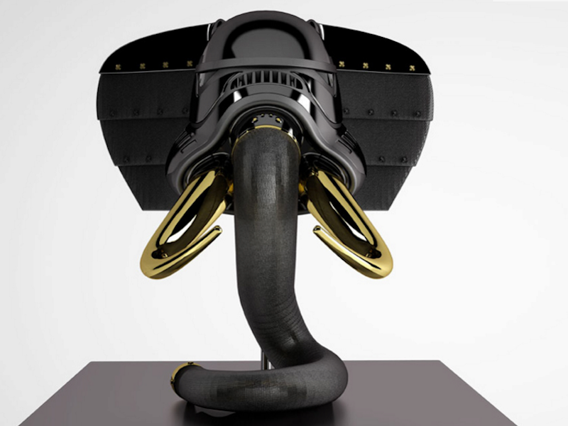
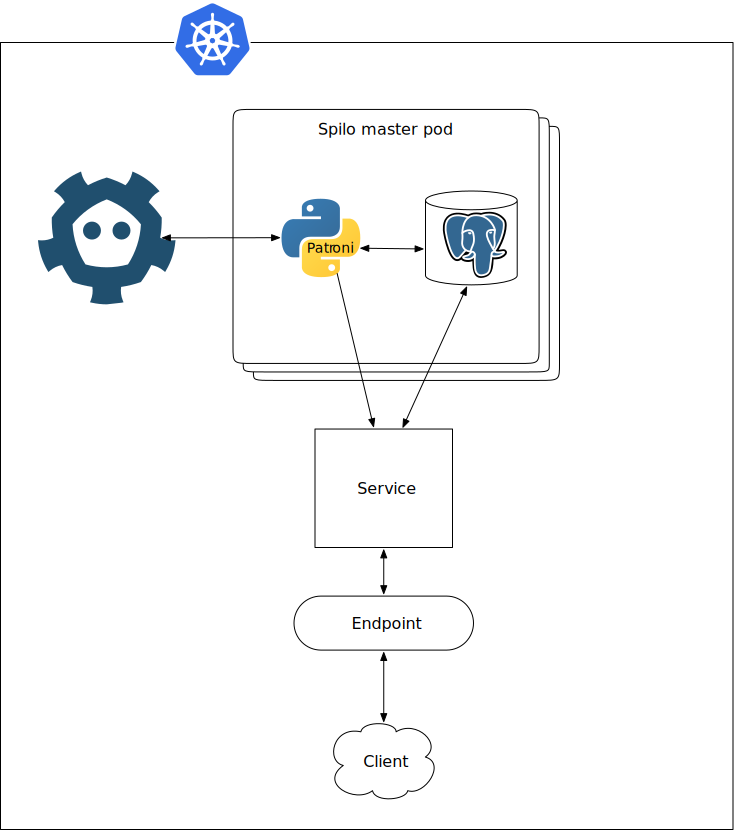
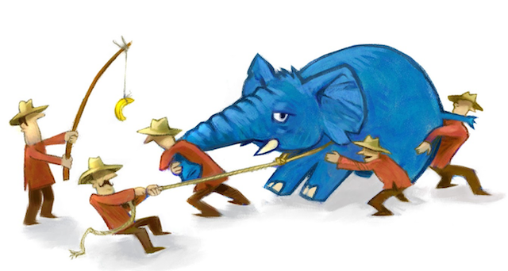

background-image: url(elephant_jog.jpg)

#### Elephants on Automatic

.sigblock[
Josh Berkus, Red Hat

Oleksii Kliukin, Zalando

Kubecon EU 2017
]

.leftlogo[

]

---

### Getting to State

---

## Stateless Now

---

## 1.5: StatefulSet

1. storage
2. identity
3. discovery

---

## Not Quite Enough

* "cluster join"
* failover
* special nodes
* rebalancing

---

## Custom Schedulers?

* not packaged with app
* kube expertise needed
* message lag

---

### Bot Pattern

---

## Bot Pattern

* control daemon in node
* runs as PID 1 in container
* communicates via consensus or kube api

---

## Bot Tasks

* initialization
* joining cluster/group
* failover
* telemetry

---

## Bot Examples

* governor
* Patroni
* entrypoint.py
* Joyent's ContainerPilot

---

### Helm

---

## Helm Adds

* parameterization
* deploy multiple instances
* app registry
* support for sidecars

---

## Examples

1. Patroni/Spilo
2. CitusDB

---

## Patroni

* HA PostgreSQL controller
* Etcd, Zookeeper or Consul
* Spilo = Patroni + PostgreSQL

---

---

## Extensibility

* callbacks
* custom replica creation methods
* pluggable consistent KV-stores

---

## More than autofailover

* synchronous mode
* cascading replication
* dynamic configuration

---

## Cluster maintenance

* "Hands-off" mode
* Scheduled failovers and restarts

---

## Interfaces

* REST API
* patronictl

---

## Helm parameters

 * cluster name
 * Etcd host
 * number of replicas
 * credentials

---

#### Patroni Demo

---

### CitusDB

---

## Sharded Parallel Postgres

* sharded Postgres
* partition data over nodes
* shards duplicate for redundancy
* query node distributes queries
* mainly for data mining (big data)

---

## StatefulSet Setup

* one query node (node 0)
* 2 to N shards
* service for query node only

---

## Simple Bot

* if node 0, query node
* if not node 1, register with query node
* updates Kubernetes label for discovery
* (auto rebalancing not OSS, yet)

---

## Helm Params

* cluster name
* cluster size
* storage allocation
* passwords

---

#### Citus Demo

---

#### Pull Requests Welcome!

github.com/zalando/patroni

github.com/jberkus/atomicdb

---

## Resources

* This Presentation:
   jberkus.github.io/container_cluster
* Simplified Configuration Scripts:
   github.com/jberkus/atomicdb/

---

## Spilo Resources

* Patroni Project:
   github.com/zalando/patroni
* Spilo Project:
   github.com/zalando/spilo
* Helm Chart:
   github.com/kubernetes
   /charts/incubator/patroni

---

## Spilo demo:

 * Helm Chart:
  github.com/alexeyklyukin/
  /charts/incubator/patroni

---

# ¿questions?

.left-column-narrow[
more jberkus:

project atomic:

&nbsp;
]

.right-column-wide[
@fuzzychef 
www.databasesoup.com 
jberkus.github.io

www.projectatomic.io

&nbsp;
]

.leftlogo[]

.rightlogo[]
