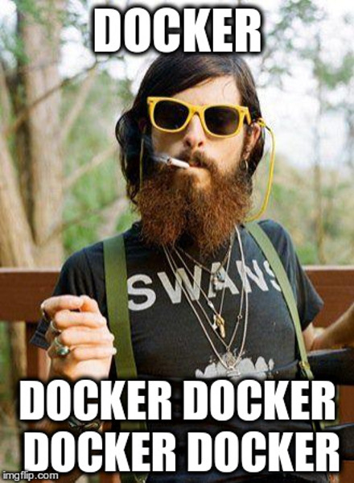
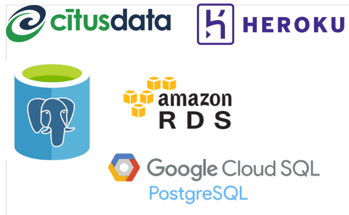
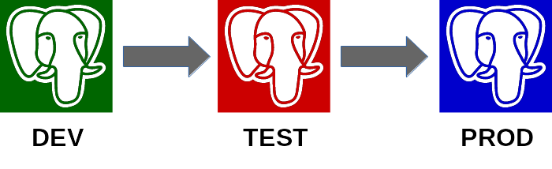
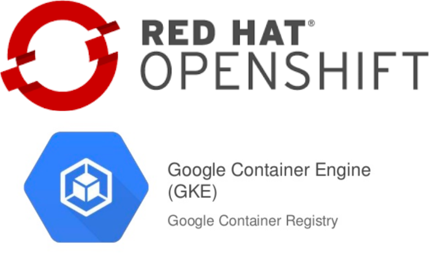

background-image: url(elephant_box.png)

# Schrödinger's Elephant

.sigblock[
Erwin Schrödinger

University of Graz

Austria 1935
]

.leftlogo[]

---

background-image: url(elephant.png)

---

background-image: url(elephant_box.png)

---

background-image: url(closed_box.png)

---

background-image: url(closed_box.png)


---

background-image: url(elephant_box.png)

---

background-image: url(dead_elephant_box.png)

---

background-image: url(elephant_superposition.png)

---

background-image: url(empty_box.png)

# Why a Box?

---



---

background-image: url(no_box.png)

---

background-image: url(escaped_elephant.png)

#### External Postgres

---



---

background-image: url(closed_box.png)

#### Portability

---

## Portability



---

## Orchestration


---

```
apiVersion: apps/v1beta1
kind: StatefulSet
metadata:
  name: patroni
  labels:
    component: patroni-patroni
spec:
  serviceName: patroni
  replicas: 3
  template:
    metadata:
      name: patroni
      labels:
        component: patroni-patroni
      annotations:
        pod.alpha.kubernetes.io/initialized: "true"
```

---



---

background-image: url(dead_elephant_box.png)

# Problems in a Box

---

background-image: url(big_elephant_flat_box.png)

---

## Big Elephant Problems

* memory management<br />
  (cgroups issues)
* orchestration wants sharing
* expensive replicas
* observability

---

## Happy Boxaphants

* small databases
* multiple cheap replicas
* can promote images from testing
* self-service for developers

---

background-image: url(elephant_superposition.png)

# Observability

---

background-image: url(elephant.png)

---

background-image: url(closed_box.png)

---

background-image: url(closed_box_meter.png)

---

## Health Checks

```
"readinessProbe": {
  "timeoutSeconds": 1,
  "initialDelaySeconds": 5,
  "exec": {
    "command": [ "/bin/sh", "-i", "-c", "psql -h 127.0.0.1 -U $POSTGRESQL_USER -q -d $POSTGRESQL_DATABASE -c 'SELECT 1'"]
  }
},
```

---

## Problems with Health Checks

* polling
* latency
* indeterminancy

---

background-image: url(elephant_superposition.png)

---

background-image: url(elephant_box.png)

#### Elephant Knows

---

## Isolation Check

1. poll *from* the box
2. response? keep on
3. no response? die

requires a consistent, available source of truth

---

```
def _run_cycle(self):
    dcs_failed = False
    try:
        self.load_cluster_from_dcs()

        if not self.cluster.has_member(self.state_handler.name):
            self.touch_member()

        # cluster has leader key but not initialize key
        if not (self.cluster.is_unlocked() or self.sysid_valid(self.cluster.initialize)) and self.has_lock():
            self.dcs.initialize(create_new=(self.cluster.initialize is None), sysid=self.state_handler.sysid)

        if not (self.cluster.is_unlocked() or self.cluster.config and self.cluster.config.data) and self.has_lock():
            self.dcs.set_config_value(json.dumps(self.patroni.config.dynamic_configuration, separators=(',', ':')))
            self.cluster = self.dcs.get_cluster()

        if self._async_executor.busy:
            return self.handle_long_action_in_progress()

        # we've got here, so any async action has finished. Check if we tried to recover and failed
        if self.recovering and not self.state_handler.need_rewind:
```

---

background-image: url(elephant_box.png)

#### Microservice

---

background-image: url(elephant_box.png)

#### Macroservice

---

background-image: url(closed_box_meter.png)

#### Other Meters?

---

background-image: url(elephant_superposition.png)

#### Not Just Live/Dead

---

background-image: url(elephant_box.png)

#### Live

---

#### Live, But Connections Full

---

background-image: url(elephant_box.png)

#### Live, But Connections Full

---

#### Live, But In Recovery

---

background-image: url(elephant_box.png)

#### Live, But In Recovery

---

#### Live, But Out Of Resources

---

background-image: url(elephant_superposition.png)

#### Live, But Out Of Resources

---

#### Live, But Replication Broken

---

background-image: url(dead_elephant_box.png)

#### Live, But Replication Broken

---

## More Meters

* no. connections
* replication status
* archive/backup status
* current configuration
* performance

---

## Exposed on 5432

* pg_settings
* pg_hba.conf (in 10)
* pg_config (in 10)
* connections
* replication on master
* archiving (in 9.6)

---

## Not Exposed

* replication config
* replication on replica
* recent log messages
* startup/restore failure

---

## Expose as REST

```
class RestApiHandler(BaseHTTPRequestHandler):

    def _write_response(self, status_code, body, content_type='text/html', headers=None):
        self.send_response(status_code)
        headers = headers or {}
        if content_type:
            headers['Content-Type'] = content_type
        for name, value in headers.items():
            self.send_header(name, value)
        self.end_headers()
        self.wfile.write(body.encode('utf-8'))
```

---

#### The Problem With Logs


---

# "It's in the activity log"

---

## Log Issues

* many message only appear in the Postgres logs
* logs are lost
* logs are centralized

not synchronously pollable

---

## Solutions?

* expose logs as a table?
* expose logs through daemon API?
* log management tools
* logging hooks

what about performance analysis?

---

## POWA Sidecar Container

* always available
* constant performance monitoring
* ship in PostgreSQL pods

---

# Code?

---


---


---

background-image: url(i_liked_it.png)

---

## Questions in a Box?

.left-column[
web:
<br /><br /><br />

twitter:

events:
]

.right-column[
jberkus.github.io
www.databasesoup.com
www.projectatomic.io

@fuzzychef

Open Source Summit<br />
Sept 12, Los Angeles

Usenix LISA<br />
October 30, San Francisco
]

.leftlogo[]

.rightlogo[]
