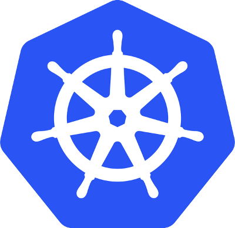
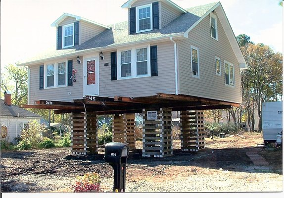
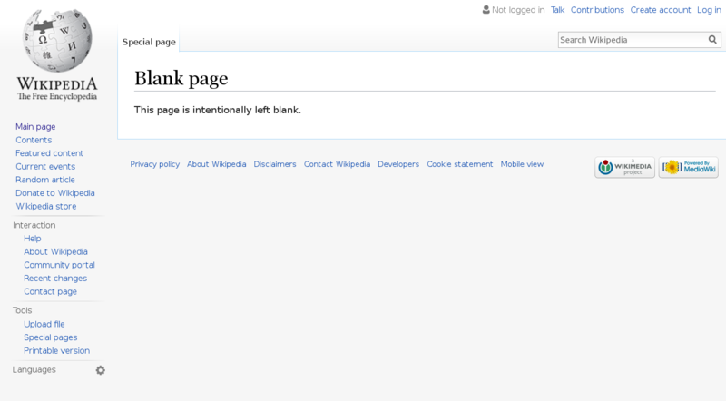
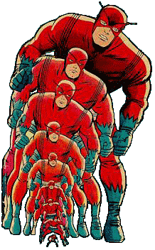

.sigblock[
Josh Berkus

Red Hat OSAS

SCALE 15x 2017
]

.leftlogo[]

---


---



---

## Kubernetes StatefulSet

A set of APIs for running stateful applications
in a Linux container cloud.

(aka PetSet)

---

## Code

github.com/jberkus/atomicdb

---


---


---

>The way containers are designed, and particularly the way Docker is designed, the assumption is that the container is stateless. -- Mark Davis, ClusterHQ

---

> Twelve-factor processes are stateless and share-nothing. Any data that needs to persist must be stored in a stateful backing service, typically a database.  12factor.net

---

#### "backing service"

---


---


---



---


---



---

#### State What?

---

## What is State?

the difference between
code and running applications

---

## Minimal State

* current task
* memory cache
* cluster deployment

---


### Scale Of State

---


### Switching Cost

---

## Four Stateful Qualities

1. Storage
2.   
3.  
4.  

---

## Four Stateful Qualities

1. Storage
2. Node Identity
3. Cluster Role
4. Session State

---



### 1. Storage

---

## Storage Requirements

* goes with the container
* exclusive write access

---

## Storage Solutions

1. automated dir naming
  <br />in app initialization
2. automated data migration
    <br />Flocker Volumes
3. network storage
  <br />(allocated per container)
  <br />Kube StatefulSet PVT

---

## StatefulSet PVT

* Persistent Volume Template
* Requests new network storage for each pod
* Storage associated with the pod (container)
* Replacements get same storage

---

## StatefulSet PVT

```
volumeClaimTemplates:
- metadata:
    name: pgdata
    annotations:
      volume.alpha.kubernetes.io/storage-class: anything
  spec:
    accessModes: [ ReadWriteOnce ]
```

---

## StatefulSet PVT

```
[root@ip-172-31-47-16 ~]# kubectl get pvc
NAME               STATUS  CAPACITY   AGE
pgdata-patroni-0   Bound   25Gi       59m
pgdata-patroni-1   Bound   25Gi       59m
pgdata-patroni-2   Bound   25Gi       59m
```
---

## StatefulSet PVT Limitations

* no local storage (yet)
* recovery logic
* garbage collection

---


### 2. Identity

---


---


---

## Identity Needs

* peering nodes
  <br />etcd, cassandra
  <br />replication slots
* special nodes
  <br />replication master
  <br />reporting nodes
  <br />spares/shadows

---

## Identity Attributes

1. individual
2. durable
3. predictable
4. addressable

---

## StatefulSet Identity

```
[centos@ip-172-31-45-224 ~]$ kubectl get pods
NAME            READY     STATUS    RESTARTS   AGE
etcd-0          1/1       Running   0          5d
etcd-1          1/1       Running   0          5d
etcd-2          1/1       Running   0          5d
patroni-0       1/1       Running   0          2d
patroni-1       1/1       Running   0          2d
patroni-2       1/1       Running   0          2d
patroni-3       1/1       Running   0          2d
patroni-4       1/1       Running   0          2d
```

---

## StatefulSet Identity

* pods start with -0 and increment
* pods start in order
* routable as pod-0.service.svc.cluster.local

---

## StatefulSet WIP

* replacement
* promotion
* namespacing
* shadow nodes
* federation

---


### 3. Cluster Role

---

## Cluster Role

what is my job in the cluster?

* replication master
* shard X
* storage bucket Y
* bootstrap node

---

## Cluster Role

* can (does) change
* sometimes exclusive
* leader elections

---

## Cluster Role

DCS to the rescue!

1. DCS shared config
2. DCS leader elections
3. annotations/labels

---

## DCS?

distributed consensus store

* etcd
* consul
* zookeeper
* embedded RAFT

consistent, fault-tolerant

---

## DCS vs. Embedded

DCS: scale, manage separately.  Proven software.

Embedded: Just One Image. Fewer cluster fail scenarios.

---

## Bot/Autopilot


---

## Bot Code

Code in the application container which automatically manages its Cluster Role using a simple state machine and access to a consensus store.

* automatic
* autonomous
* correct

---

## Cluster Role

```
[root@psql-3615923279-dvli8 /]# curl -L
etcd:2379/v2/keys/service/patroni01/members/patroni_2
{
...
{role:master,
 state:running,
 conn_url:postgres://patroni-2.patroni:5432/postgres,
 api_url:http://patroni-2.patroni:8008/patroni,
 xlog_location:67109184}
    }
}
```

---

## Cluster Role

```
kubectl get pods -l patroni-role -L patroni-role
NAME        READY     STATUS       PATRONI-ROLE
patroni-0   1/1       Running      replica
patroni-1   1/1       Running      replica
patroni-2   1/1       Running      master
```

---

## Bot/DCS Issues

* switching asynchronous
* inconsistency
* failover data loss
* cluster failure
* MOAR TESTING!

---


### 4. Sessions

---


## Session State

not everything is a REST request

* downloads
* database transactions
* data state
* auth server sessions

---

## Session State

solutions?

* discovery DNS
  <br />... don't follow failover
* smart proxies
  <br />... not done yet

---

## Discovery DNS

```
psql -h pgwrite.patroni.default.svc.cluster.local
psql -h pgread.patroni.default.svc.cluster.local
```

---

## Session State Future

Develop smart proxies which read Cluster Role events and automatically reconfigure and fail over connections according to an autonomous rules system.

---

## Stateful Solutions

1. Storage: StatefulSet PVT (70%)
2. Identity: StatefulSet (90%)
3. Cluster Role: DCS + Bot (70%)
4. Session: Discovery DNS (50%)

---

## ¿questions?

.left-column[
more<br />jberkus:


more<br />events:
]

.right-column[
www.projectatomic.io<br />
@fuzzychef<br />
jberkus.github.io

Kubecon EU<br />
March 27, Berlin

Cloud Native PDX
<br />Meetup
]

.leftlogo[]

.rightlogo[]
