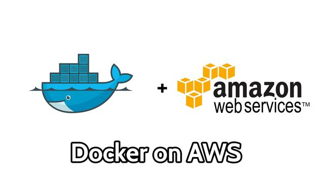
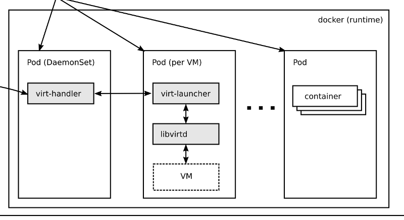
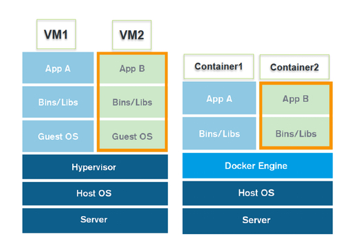
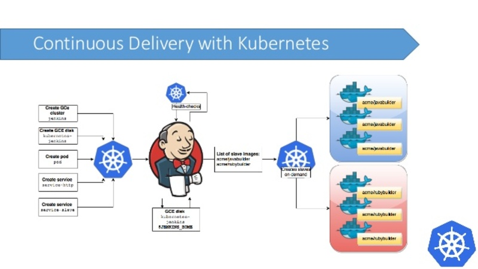

background-image: url(choc1.jpg)

#### You Got Your VM<br />In My Container

.sigblock[
Jason Brooks<br />
Josh Berkus<br />
Red Hat OSAS<br />
SCALE 16x
]

.leftlogo[]

---


### VM vs Container

---


### Containers-in-VMs

---



---



### VMs-in-containers

---


### VMs-on-Kubernetes

---

Why would we want this?

---

VMs are awesome, but...

They require infra like shared storage, and HA management services

---

My Lab:

Hyper-Converged oVirt + Gluster

---

Enter Kubernetes

I get to thinking about *more* convergence...

---

background-image: url(kube-wheel.png)

---

A lot of it worked:

Storage, Management, Authentication

---

Virtualization?

Way too janky, so I punted...

---

Container-native storage has continued to progress

* Gluster CNS
* Ceph (Rook)

---

# KubeVirt

*an add-on that extends kubernetes to support scheduling of VM workloads alongside container workloads*


---

# KubeVirt Anatomy

---

Custom Resource Definitions

* New virt-specific object types added to the kube apiserver
* Manage like other kube objects, using kubectl

---

virt-controller

* A kubernetes operator
* Watches the apiserver for VM objects
* Creates pods for new VMs to like in

---

virt-handler

* One of these runs on every node
* Takes over the VM pod once the virt-controller creates it
* Starts up libvirt inside the pod

---

virt-launcher

* Each VM gets a virt-launcher pod
* This is the pod that the virt-controller creates initially, and the virt-handler takes over

---

storage

* pv volumes
* ephemeral volumes
* registry disk volumes
* cloud-init nocloud volumes

---

networking

* Regular pod networking
* Every kubernetes pod gets its own IP
* Expose ports with kube services

---

# Demo

---

... but ...<br /><br />I only wanted VM security ...

---


---

## Container Isolation

* namespaces
* SECCOMP
* SE-Linux
* bubblewrap
* Clair & OpenSCAP

---

## Kernel exploits



---


---

### Resource usage


---


---


---



---


---


---

## Minimal VM wrapper

* Linux-based
* contains microkernel and not much else<br />
  https://github.com/kata-containers/osbuilder
* sub-second startup

---


---

## CRI: Container Runtime Interface


---

## How Kata works

1. Kubernetes calls CRI
2. CRI calls CRI-O
3. CRI-O calls cc-runtime
4. cc-runtime starts mini-VM
5. mini-VM runs Kube pod

---

## Startup Times

* Container: 5ms
* Katacontainer: 100ms
* KubeVirt VM: 30s

(times are for example only)

---

## Trusted/Untrusted

```
annotations:
  io.kubernetes.cri-o.\
    TrustedSandbox: “false”
```

---

## Limitations

* pre-alpha
* Linux guest only
* no special devices
* can't support VM apps

---

#### Demo

---

## Other Technologies

* Virtlet
* Rkt VMs
* RancherVM (RIP)
* Service Broker

---

## SuperDuper-<br>HyperConvergance

* Use Kubernetes to manage VMs
* Give VMs access to Kube resources
* Add VM security to containers
* Run VMs on Containers on VMs!

---

background-image: url(chocolate-peanut-butter-cup-smoothie4.jpg)

#### Two Great Tastes<br />Taste Great Together

---

## links

* www.kubervirt.io
* www.katacontainers.io
* www.cri-o.io
* \#virtualization on Kube Slack<br />
  slack.k8s.io

---

# ¿questions?

.left-column-narrow[
more<br />jberkus:

jbrooks:

Red Hat:

&nbsp;
]

.right-column-wide[
@fuzzychef<br />
jberkus.github.io

@jasonbrooks

community.redhat.com

&nbsp;
]

.leftlogo[]

.rightlogo[]
