background-image: url(choose.png)

.sigblock[
Josh Berkus

Red Hat OSPO

SCALE 19x
]

.leftlogo[]

---

# Me & Elections

* Maintainer of Elekto project
* Election Officer for Kubernetes, Knative
* OSI Election Tools Committee
* Long ago: CA election reform lobbyist

twitter: @fuzzychef

---

# You & Elections

You are one of:

1. Project leader/founder
2. Project contributor
3. Community manager
4. OSPO staff
5. Governance geek
6. Just curious

---

# You Are *Not*

... looking for a solution for public political elections

---

background-image: url(votekey4.jpg)

#### Open Source Project Elections?

---

# Some OSS projects have elections

* Kubernetes
* Knative
* Fedora

Steering committee, project leader, technical oversight committee

---

# OSS Foundations all have elections

* OpenStack
* Gnome
* Debian/SPI
* OSI

---

# There's even a template!

```
The [TODO: PROJECTNAME] Steering Committee is
the governing body of the [TODO: PROJECTNAME] 
project, providing decision-making and oversight
pertaining to the project bylaws, 
sub-organizations, and financial planning. The
Steering Committee also defines the project 
values and structure.
```

gh.com/cncf/project-template

---

### What do Open Source projects need for elections?

1. Online & public
2. Secret ballot
3. Voter authentication
4. Archival records
5. Preference voting

---

### What do Open Source projects need for elections?

1. **Online & public**
2. Secret ballot
3. **Voter authentication**
4. Archival records
5. Preference voting

---

### Voter Auth for OSS

* standalone app
* email
* Oauth

---

### Voter Auth for OSS

* ~~standalone app~~
* email
* Oauth

---

### Voter Auth for OSS

* email
  * best for: ML-heavy projects
  * bounce problems
* Oauth
  * best for: GH-heavy projects
  * need external provider
  
---

### What do Open Source projects need for elections?

1. Online & public
2. **Secret ballot**
3. Voter authentication
4. Archival records
5. Preference voting

---

# Secret Ballots

secret from:

* other voters
* candidates
* *system admins of the voting system*

... time for cryptography!

---

#### ~~Blockchain~~

---

# Secret But Public

By encrypting connections between voters and ballots we can have public or semi-public systems with secret ballots

```
id        | 60
ballot_id | \x3132302dca9588dd ...

election_id | 1
rank        | 1
candidate   | elekto
voter       | 702a87f5-243a-49d0-8bcb-147d7a5b9ef9
```

---

### What do Open Source projects need for elections?

1. Online & public
2. Secret ballot
3. Voter authentication
4. Archival records
5. **Preference voting???**

---

background-image: url(votekey4.jpg)

#### What Is A Preference Election?

---

# "Regular" elections

1. Everyone votes for a candidate
2. Top vote-getter(s) win

Called "plurality" or "first-past-the-post"

---

# The problem with plurality

*An extreme candidate with a dedicated minority of followers often wins over a generally liked candidate*

---

# What's a preference election?

1. Vote which candidate you'd *prefer* to each other candidate
2. The most *generally acceptable* candidate(s) wins

---


### Story Time!

---


---

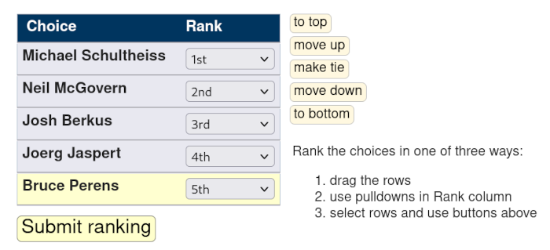

---

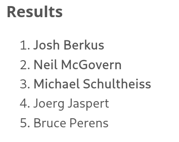

---

# Preference election types

1. Instant Runoff (IRV)<br />
2. Ranked Choice

---

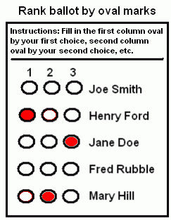

### IRV


---

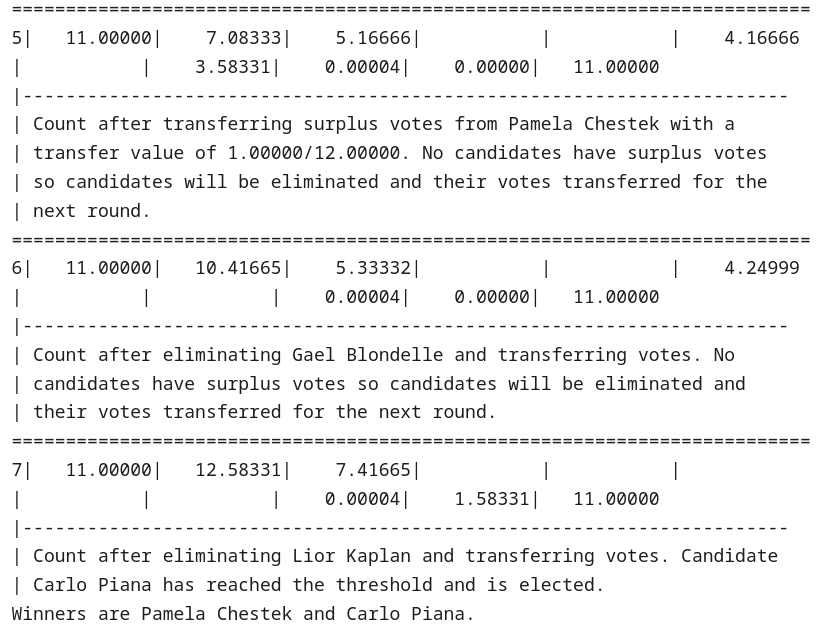
 
---

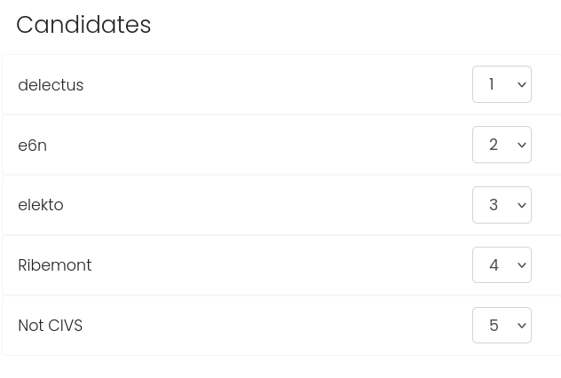

### Ranked Choice

---

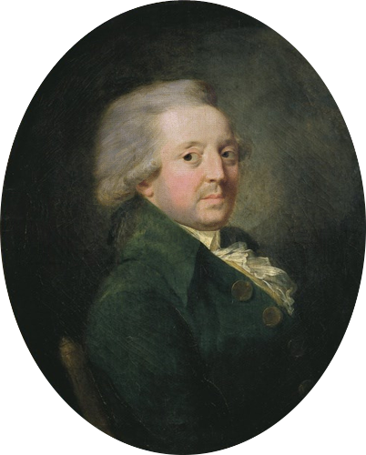

### Marquis de Condorcet 

---

# Condorcet Method

*A mathematical way of testing whether the most preferred candidate wins*

* multiple "condorcet methods" for actual tally
* all compare pairwise preferences
* some also do DAG

---

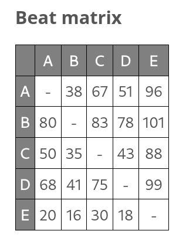

## Ranked Calculation

---

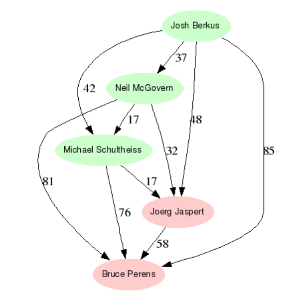

---

background-image: url(votekey4.jpg)

#### Choosing<br />Election<br />Software

---

# Evaluating Election Software

1. Hosting options
2. Vote tally options
3. Auth options

---

# Election hosting

* Self-hosted (OSS software)
* Free hosting
* Paid hosting

---

# Four Platforms

* CIVS
* Helios
* OpaVote
* Elekto

---


### CIVS

---

# What's CIVS?

* Granddaddy voting software (2003)
* Condorcet Internet Voting System
* Maintained/hosted by Cornell University

---

# CIVS Eval

* Self Host or Free Hosting
* All Condorcet methods + proportional
* Email auth via tokens

---

# CIVS +/-

* Localized in 5 languages
* Really old code (Perl 5)
* Poor email handling, spam issues
* Hosting is best-effort

---

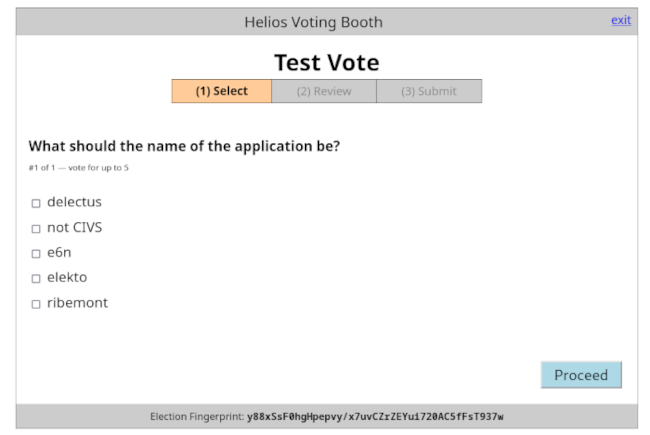

### Helios

---

# What's Helios?

An open source voting system created by election geeks that focuses on end-to-end encryption and verifiability.

---

# Helios Eval

* Self host or free hosting
* *No preference elections*
* Email or github Oauth

---

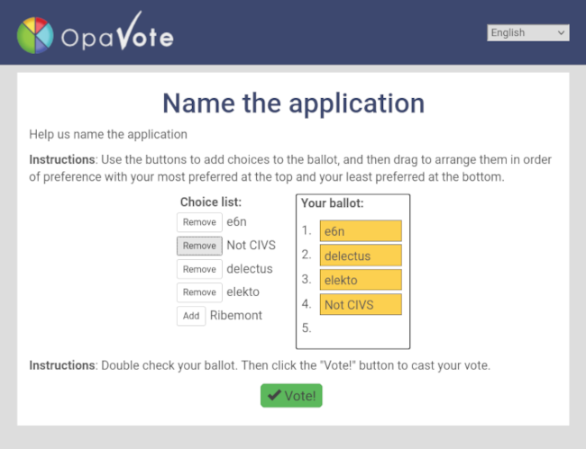

### OpaVote

---

# What's OpaVote?

A closed-source voting system created by verifiable election lobbyists as a business.

---

# OpaVote Eval

* Paid hosting
* Several Condorcet & IRV methods
* Email auth

---

# OpaVote +/-

* Paid hosting & docs are high-quality
* Automated reminders
* Localized in 4 languages

---

# Similar to Opavote

* Election Buddy
* Election Runner
* Simply Voting

---

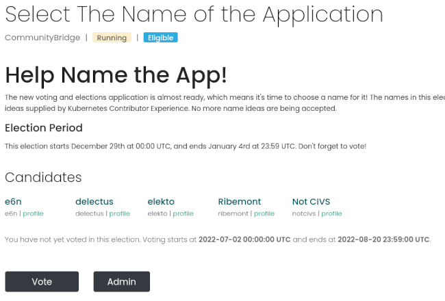

### Elekto

---

# What's Elekto?

A GitOps-centric election system developed by CNCF/Kubernetes contributors to support CNCF project elections.  A project of TAG Contributor Strategy.

---

# Elekto Eval

* Self hosting
* Schulze Condorcet right now
* Oauth (GH)

---

# Elekto +/-

* Very Github/Gitlab centric (everything but voting is a PR)
* Young/small project
* Very simple/portable code
* Election admin teams

---

background-image: url(votekey4.jpg)

#### Elekto Tour

(time permitting)

---

# Conclusions

*You can (and should) have online, secret, elections for the offices in your project or foundation.*

* Prefer preference elections
* OSS and proprietary options 
* Various auth and hosting options

---

# ¿questions?

.left-column[
more<br />jberkus:


more resources:
]

.right-column[
@fuzzychef<br />
jberkus.github.io

www.elekto.dev<br />
github/cncf/project-templates<br />
<br />
]

.leftlogo[]

.rightlogo[]

---

# Links

* [CIVS](https://civs1.civs.us/)
* [Helios](https://heliosvoting.org)
* [OpaVote](https://www.opavote.com)
* [Elekto](https://elekto.dev)
* [Instant Runoff Voting](https://en.wikipedia.org/wiki/Ranked_voting)
* [Condorcet Method](https://en.wikipedia.org/wiki/Condorcet_method)
* [Steering Elections Template](https://github.com/cncf/project-template)


---

# Licensing

This presentation is licensed [Creative Commons Share-Alike 4.0](https://creativecommons.org/licenses/by-sa/4.0/legalcode).

Trademarks and logos included herein belong to their respective owners,
and are included to refer to their respective products.
